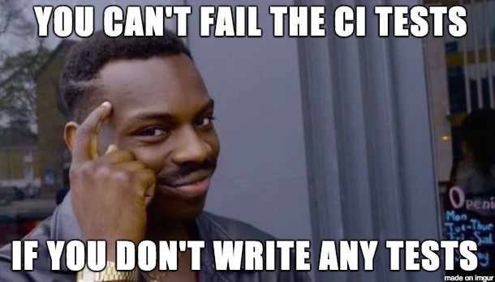

# 10. Privacy computing


## Continues-Integration

Continues integration (CI) is a development practise that makes sure that updates to code 
are automatically tested such that it does not break existing code. When we look at MLOps,
CI belongs to the operation part. 

It should be notes that applying CI does not magically secure that your code does not break.
CI is only as strong as the tests that are automatically executed. CI simply structures and
automates this.

<p align="center">
<b> “Continuous Integration doesn’t get rid of bugs, but it does make them dramatically easier to find and remove.” -Martin Fowler, Chief Scientist, ThoughtWorks </b>
</p>



### Exercises

The following exercises should be applyed to your MNIST reposatory

1. The first part of doing CI is writing the unit tests. We do not expect you to cover every part
   of the code you have developed but try to atleast write tests that cover two files. Start by
   creating a `tests` folder.

2. Read the [getting started guide](https://docs.pytest.org/en/6.2.x/getting-started.html) for pytest
   which is the testing framework that we are going to use
   
3. Install pytest:

   ```
   pip install pytest
   ```
   
4. Write some tests. Below are some guidelines on some tests that should be implemented, but
   you are ofcause free to implement more tests. You can at any point check if your tests are
   passing by typing in a terminal
   
   ```
   pytest tests/
   ```

   4.1. Data testing: 

   4.2. Model testing: In a file called `tests/test_model.py` implement atleast a test that
        checks for a given input with shape *X* that the output of the model have shape *Y*
   
   4.3. Training testing: In a file called `tests/test_training.py` 

