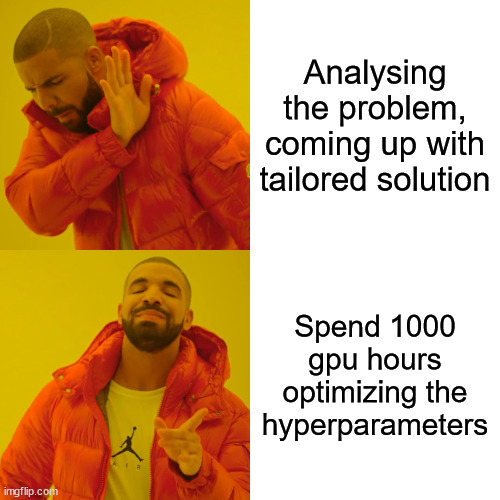

### 9. Hyperparameter optimization
For todays exercises we will be integrating [optuna](https://optuna.readthedocs.io/en/stable/index.html) into 
our different models.



### Exercises

1. Start by installing optuna:
   `pip install optuna`
   
2. Initially we will look at the `cross_validate.py` file. It implements simple K-fold cross validation of
   a random forest sklearn digits dataset (subset of MNIST). Lookover the script and try to run it.
   
3. We will now try to write the same code in optune. Please note that the script have a variable `OPTUNA=False`
   that you can use to change what part of the code should run. The three main concepts of optuna is
   
   * A trial: a single experiment
   
   * A study: a collection of trials
   
   * The objective: function to determine how "good" a trial is
   
   Lets start by writing the objective function, which we have already started in the script. For now you do
   not need to care about the `trial` argument, just assume that it contains the hyperparameters needed to
   define your random forest model. The output of the objective function should be a single number that we
   want to optimize. (HINT: did you remember to do K-fold crossvalidation inside your objective function?)
   
4. Next lets focus on the trial. Inside the `objective` function the trial should be used to suggest what
   parameters to use next. Take a look at the documentation for [trial](https://optuna.readthedocs.io/en/stable/reference/generated/optuna.trial.Trial.html)
   or take a look at the [code examples](https://optuna.org/#code_examples) and figure out how to define
   the hyperparameter of the model.
   
5. Finally lets launch a study. It can be as simple as

   ```
   study = optuna.create_study()
   study.optimize(objective, n_trials=100)
   ```
   
   but lets play around a bit with it:
   
   5.1. By default the `.optimize` method will minimize the objective (by definition the optimum of an objective
        function is at its minimum). Is the score your objective function is returning something that should
        be minimized? If not, a simple solution is to put a `-` infront. However, look through the documentation
        on how to change the **direction**.
        
   5.2. Optuna will by default do baysian optimization when sampling the hyperparameters. However, since this
        example is quite simple, we can actually perform a full grid search. How would you do this in Optuna?
        
   5.3. Compare the performate of a single optuna run using baysian optimization with `n_trials=10` with a
        exhaustive grid search that have search through all hyperparameters. What is the performace/time
        trade-off for these two solutions?

6. In addition to doing baysian optimization, the other great part about Optuna is that it have native support
   for **Pruning** unpromising trials. Pruning refers to the user stopping trials for hyperparameter combinations
   that does not seem to lead anywhere. You may have learning rate that is so high that training is diverging or
   a neural network with too many parameters so it is just overfitting to the training data. This however begs the
   question: what consitutes an unpromising trial? This is up to you to define based on prior experimentation.
   
   6.1. Start by looking at the `simple_neural_network.py` script. Its a simple regression network for predicting
        ???. Run the script with the default hyperparameters to get a feeling of how the training should be progress.
        Note down the performance on the test set.
        
   6.2. Now, adjust the script to use Optuna. Atleast 5 hyperparameters needs to be tunable. Run a small study
        (`n_tirals=3`) to check that the code is working.
        
   6.3. If implemented correctly the number of hyperparameter combinations should be around ???^??? meaning that
        we not only need baysian optimization but probably also need pruning to succed. Checkout the page for
        [build-in pruners](https://optuna.readthedocs.io/en/stable/reference/pruners.html) in Optuna. Implement
        pruning in the script. I recommend using either the `MedianPruner` or the `ProcentilePruner`. 
        
   6.4 Re-run the study using pruning with a large number of trials (`n_trials>50`) 

   6.5 Take a look at this [visualization page](https://optuna.readthedocs.io/en/latest/tutorial/10_key_features/005_visualization.html) 
       for ideas on how to visualize the study you just did. Make atleast two visualization of the study and
       make sure that you understand them.
   
   6.6 Pruning is great for better spending your computational budged, however it comes with a trade-off. What is
       it and what hyperparameter should one be especially careful about when using pruning?
   
   6.7 Finally, what parameter combination achived the best performance? What is the test set performance for this
       set of parameters. Did you improve over the initial set of hyperparameters?

7. The exercises until now have focused on doing the hyperparameter searching sequentially, meaning that we test one
   set of parameters at the time. It is a fine approach because you can easely let it run for a week without any
   interaction. However, assuming that you have the computational resources to run in parallel, how do you do that.
   
   

### Final exercise

Apply the techniques you have just learned to the running MNIST example. Feel free to choose what hyperparameters that you
want to use 
   

   
