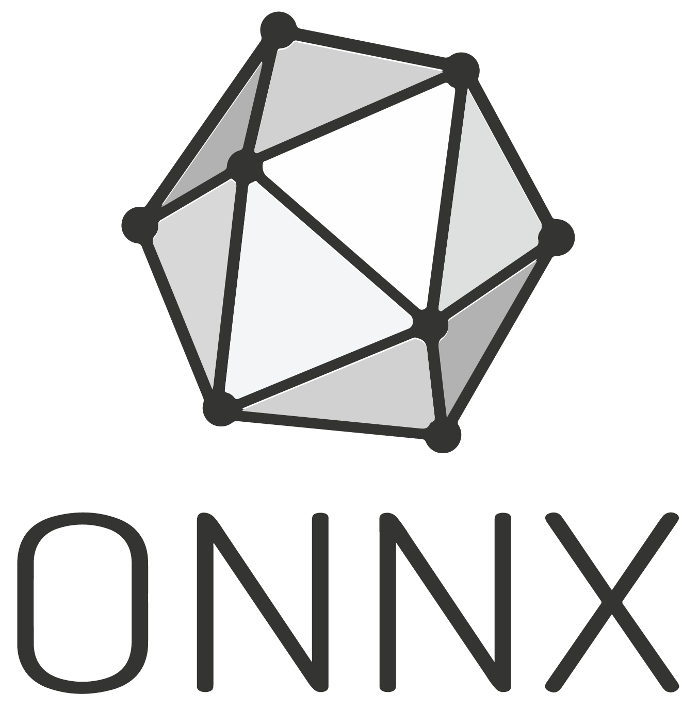
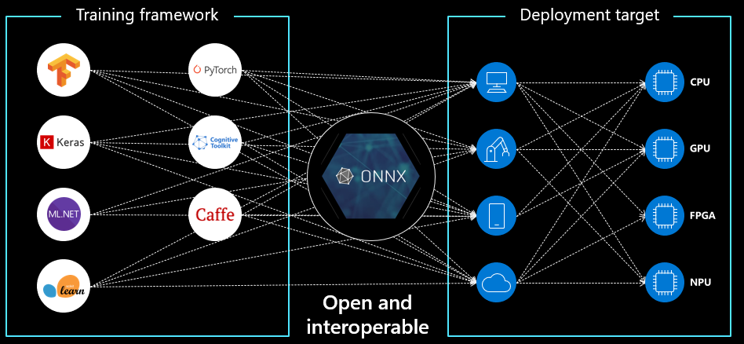

{ align=right width="130"}

# Onnx

---

!!! danger
    Module is still under development

# Model packaging

Whenever we want to serve an machine learning model, what we are actually interested in is doing *predictions* e.g.
given a new datapoint we pass it through our model (forward pass) and the returned value is the predicted value of
that datapoint. At a high-level, model predictions depends on three things:

* The codebase that implements the models prediction method
* The model weights which contains an actual instance of the model
* Code dependencies nessesary for running the codebase.

We have already in module [M9 on Docker](../s3_reproducibility/docker.md) touch on how to take care of all
these things. Containers makes it easy to link a codebase, model weights and code dependencies into a single object.
We in general can refer to this as *model packaging*, because as the name suggest, we are packaging our model into
a format that is *independent* of the actual environment that we are trying to run the model in.

However, containers is not the only way to do model packaging. If we put some light restrictions on the device we want
run our model predictions on, we can achieve the same result using ONNX. The
[Open Neural Network Exchange (ONNX)](https://onnx.ai/) is a standardized format for creating and sharing machine
learning models. ONNX provides an [open source format](https://github.com/onnx/onnx) for machine learning models,
both deep learning and traditional ML. It defines an extensible computation graph model, as well as definitions of
built-in operators and standard data types.

<figure markdown>
  { width="600" }
  <figcaption> <a href="https://www.xenonstack.com/blog/onnx"> Image credit </a> </figcaption>
</figure>

As the above image indicates, the idea behind ONNX is that a model trained with a specific framework on a specific
device, lets say Pytorch on your local computer, can be exported and run with an entirely different framework and
hardware easily. For example, not all frameworks are created equally. For example Pytorch is in general considered
an developer friendly framework, however it has historically been slow to run inference with compared to a framework
such as [Caffe2](https://caffe2.ai/). ONNX allow you to mix-and-match frameworks based on different usecases, and
essentially increases the longivity of your model.

## Exercises

1. Start by installing ONNX:

   ```bash
   pip install onnx
   pip install onnxruntime
   ```

   the first package includes the basic building blocks for implementing generalized ONNX models and the second
   package is for running ONNX optimal on different hardware.

2. As an test that your installation is working, try executing the following python code

   ```python
   import onnxruntime
   onnxruntime.get_all_providers()
   ```

   these providers are *translation layers* that are implemented ONNX, such that the same ONNX model can run on
   completely different hardware. Can you identify at least two of the providers that are necessary for running
   standard Pytorch code on CPU and GPU? Can you identify others

3. One big advantage of having a standardized format, is that we can easily visualize the computational graph of our
   model because it consist only of core ONNX operations. We are here going to use the open-source tool
   [netron](https://github.com/lutzroeder/netron) for visualization. You can either choose to download the program
   or just run it in your [webbrowser](https://netron.app/).
