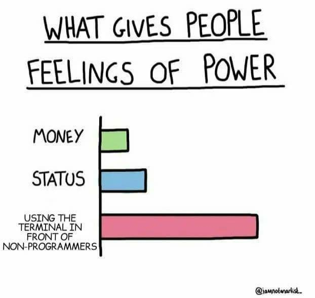
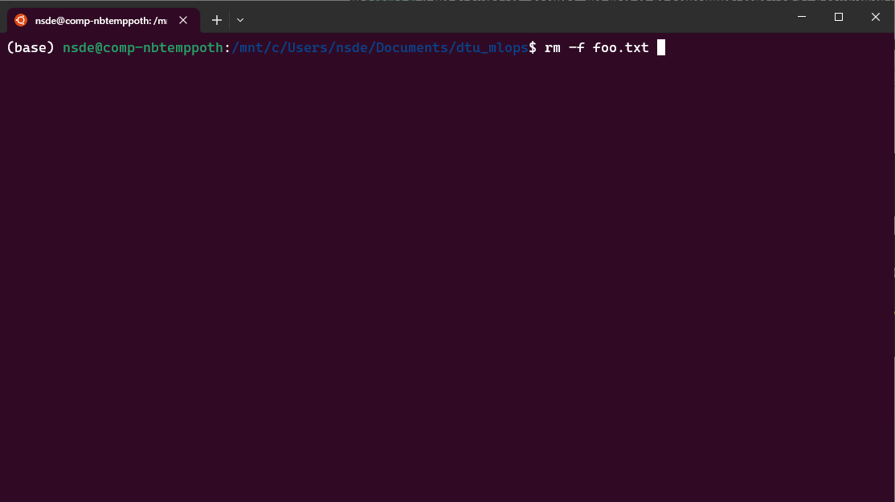
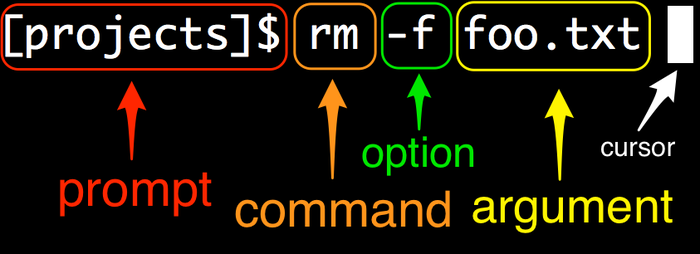

{ align=right width="130"}

# The command line

---

!!! info "Core Module"

<figure markdown>
  { width="500" }
  <figcaption> <a href="https://twitter.com/rorypreddy/status/1257336536477171712"> Image credit </a> </figcaption>
</figure>

Contrary to popular belief, the command line (also commonly known as the *terminal*) is not a mythical being that has
existed since the dawn of time. Instead, it was created at a time when it was not given that your computer had a
graphical interface that you could interact with. Think of it as a text interface to your computer.

It is a well-known concept to users of linux, however MAC and (especially) Windows users not so much. Having a basic
understanding of how to use a command line can really help improve your workflow. The reason that the command line is an
important tool to get to know, is that doing any kind of MLOps will require us to be able to interact with many
different tools, many which does not have a graphical interface. Additionally, when we get to working in the cloud
later in the course, you will be forced to interact with the command line.

Note if you already are a terminal wizard then feel free to skip the exercises below. They are very elementary.

## The anatomy of the command line

Regardless of operating system, all command lines looks more or less the same:

<figure markdown>
{ width="800" }
</figure>

As already stated, it is essentially just a big text interface to interact with your computer. As the image illustrates,
when trying to execute a command, there are several parts to it:

1. The **prompt** is the part where you type your commands. It usually contains the name of the current directory you
    are in, followed by some kind of sign: `$`, `>`, `:` are the usual ones. It can also contain other information,
    such as in the case of the above image it is also showing the current `conda` environment.
2. The **command** is the actual command you want to execute. For example, `ls` or `cd`
3. The **options** are additional arguments that you can pass to the command. For example, `ls -l` or `cd ..`.
4. The **arguments** are the actual arguments that you pass to the command. For example, `ls -l figures` or `cd ..`.

The core difference between options and arguments is that options are optional, while arguments are not.

<figure markdown>
{ width="800" }
<figcaption> <a href="https://www.learnenough.com/command-line-tutorial/basics"> Image credit </a> </figcaption>
</figure>

## ❔ Exercises

We have put a cheat sheet in the
[exercise files folder](https://github.com/SkafteNicki/dtu_mlops/blob/main/s1_development_environment/exercise_files/command_line_cheatsheet.pdf)
belonging to this session, that gives a quick overview of the different commands that can be executed in the
command line.

???+ note "Windows users"

    We highly recommend that you install *Windows Subsystem for Linux* (WSL). This will install a full Linux system
    on your Windows machine. Please follow this
    [guide](https://docs.microsoft.com/en-us/windows/wsl/install-win10). Remember to run commands from an elevated
    (as administrator) Windows Command Prompt. You can in general complete all exercises in the course from a normal
    Windows Command Prompt, but some are easier to do if you run from WSL.

    If you decide to run in WSL you need to remember that you now have two different systems, and install a package
    on one system does not mean that it is installed on the other. For example, if you install `pip` in WSL, you
    need to install it again in Windows if you want to use it there.

    If you decide to not run in WSL, please always work in a Windows Command Prompt and not Powershell.

1. Start by opening a terminal.

2. To navigate inside a terminal, we rely on the `cd` command and `pwd` command. Make sure you know how to go back and
    forth in your file system. HINT: try [tab-completion](https://en.wikipedia.org/wiki/Command-line_completion) to
    save some time.

3. The `ls` command is important when we want to know the content of a folder. Try to use the command, and also try
    it with the additional option `-l`. What does it show?

4. Make sure to familiar yourself with the `which`, `echo`, `cat`, `wget`, `less` and `top` commands. Also familiarize
    yourself with the `>` operator. You are probably going to use some of them throughout the course or in your future
    career. For Windows users these commands may be named something else, e.g. `where` command on Windows corresponds
    to `which`.

5. It is also significant that you know how to edit a file through the terminal. Most systems should have the
    `nano` editor installed, else try to figure out which one is installed in your system.

    1. Type `nano` in the terminal

    2. Write the following text in the script

        ```python
        if __name__ == "__main__":
            print("Hello world!")
        ```

    3. Save the script and try to execute it

    4. Afterward, try to edit the file through the terminal (change `Hello world` to something else)

6. All terminals come with their own programming language. The most common system is called `bash`. It can come in handy
    being able to write simple programs in bash. For example, one case is that you want to execute multiple python
    programs sequentially, which can be done through a bash script.

    1. Write a bash script (in `nano`) and try executing it:

        ```bash
        #!/bin/bash
        # A sample Bash script, by Ryan
        echo Hello World!
        ```

    2. Change the bash script to call your python program you just wrote.

    3. Try to Google how to write a simple for-loop that executes the python script 10 times in a row.

## Knowledge check

??? question "Knowledge question 1"

    Here is one command from later in the course when we are going to work in the cloud

    ```bash
    gcloud compute instances create-with-container instance-1 \
        --container-image=gcr.io/<project-id>/gcp_vm_tester
        --zone=europe-west1-b
    ```

    Identify the command, options and arguments.

    ??? success "Solution"

        * The command is `gcloud compute instances create-with-container`.
        * The options are `--container-image=gcr.io/<project-id>/gcp_vm_tester` and `--zone=europe-west1-b`.
        * The arguments are `instance-1`.

        The tricky part of this example is that commands can have subcommands, which are also commands. In this case
        `compute` is a subcommand to `gcloud`, `instances` is a subcommand to `compute` and `create-with-contrainer`
        is a subcommand to `instances`

??? question "Knowledge question 2"

    Two common arguments that nearly all commands have is the `-h` and `-v` options. What does each of them do?

    ??? success "Solution"

        The `-h` (or `--help`) option prints the help message for the command, including subcommands and arguments.
        Try it out by executing `python -h`.
        <br> <br>
        The `-v` (or `--version`) option prints the version of the installed program.
        Try it out by executing `python --version`.

This ends the module on the command line. If you are still not comfortable working with the command line, fear not as
we are going to use it extensively throughout the course. If you want to spend additional time on this topic, we highly
recommend that you [watch this video](https://www.youtube.com/watch?v=oxuRxtrO2Ag) on how to use the command line.

If you are interested in personalizing your terminal, you can check out the [starship](https://starship.rs/) project,
that allows you to customize your terminal with a lot of different options.
