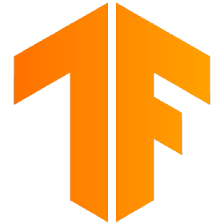
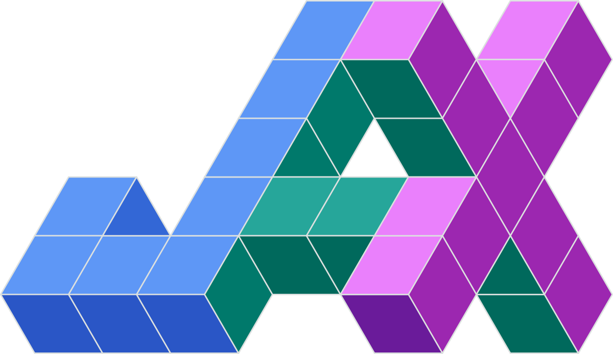

{ align=right width="130"}

# Deep Learning Software

---

!!! info "Core Module"

Deep learning have since its
[revolution back in 2012,](https://papers.nips.cc/paper/2012/hash/c399862d3b9d6b76c8436e924a68c45b-Abstract.html)
transformed our lives. From Google Translate to driverless cars
to personal assistants to protein engineering, deep learning is transforming nearly every sector of our economy and
or lives. However, it did not take long before people realized that deep learning is not as simple beast to tame
and it comes with its own kind of problems, especially if you want to use it in a production setting. In particular
the concept of [technical debt](https://research.google/pubs/pub43146/) was invented to indicate the significant
maintenance costs at an system level that it takes to run machine learning in production. MLOps should very much
be seen as the response to the concept of technical debt, namely that we should develop methods, processes and tools
(with inspiration from classical DevOps) to counter the problems we run into when working with deep learning models.

It is important to note that all the concepts and tools that have been developed for MLOps can absolutely be used
together with more classical machine learning models (think K-nearest neighbor, Random forest etc.), however
deep learning comes with its own set of problems which mostly have to do with the sheer size of the data and models
we are working with. For these reason, we are focusing on working with deep learning models in this course

## Software landscape for Deep Learning

Regarding software for Deep Learning, the landscape is currently dominated by three software
frameworks (listed in order of when they were published):

{ align=right width="120"}
{ align=right width="130"}
{ align=right width="200"}

* [Tensorflow](https://github.com/tensorflow/tensorflow)

* [Pytorch](https://github.com/pytorch/pytorch)

* [JAX](https://github.com/google/jax)

We won't go into a longer discussion on what framework is the best, as it is pointless. Pytorch and Tensorflow
have been around for the longest and therefore have bigger communities and feature sets at this point in time.
They both very similar in the sense that they both have features directed against research and production.
JAX is kind of the new kid on the block, that in many ways improve on Pytorch and Tensorflow, but is still
not as mature as the other frameworks. As the frameworks uses different kind programming principles
(object oriented vs. functional programming), comparing them is essentially meaningless.

In this course we have chosen to work with Pytorch, because we find it a bit more intuitive and it is the
framework that we use for our day to day research life. Additionally, as of right now it is the absolutely
the [dominating framework](https://www.assemblyai.com/blog/pytorch-vs-tensorflow-in-2022/) for published
models, research papers and [competition winners](https://blog.mlcontests.com/p/winning-at-competitive-ml-in-2022?s=w)

\
The intention behind this set of exercises is to bring everyones Pytorch skills up-to-date. If you already
are Pytorch-Jedi feel free to pass the first set of exercises, but I recommend that you still complete it.
The exercises are in large part taken directly from the
[deep learning course at udacity](https://github.com/udacity/deep-learning-v2-pytorch).
Note that these exercises are given as notebooks, which is the last time we are going to use them actively in course.
Instead after this set of exercises we are going to focus on writing code in python scripts.

The notebooks contains a lot of explaining text. The exercises that you are supposed to fill out are inlined in
the text in small "exercise" blocks:

<figure markdown>
  {width="1000"}
</figure>

If you need a fresh up on any deep learning topic in general throughout the course, we recommend to find the relevant
chapter in the [deep learning](https://www.deeplearningbook.org/) book by Ian Goodfellow,
Yoshua Bengio and Aaron Courville (can also be found in the literature folder).

### Exercises

[Exercise files](https://github.com/SkafteNicki/dtu_mlops/tree/main/s1_development_environment/exercise_files){ .md-button }

1. Start a jupyter notebook session in your terminal (assuming you are standing in the root of the course material)

    ```bash
    jupyter notebook s1_development_environment/exercise_files/
    ```

2. Complete the [Tensors in Pytorch](exercise_files/1_Tensors_in_PyTorch.ipynb) notebook. It focuses on basic
    manipulation of Pytorch tensors. You can pass this notebook if you are comfortable doing this.

    1. (Bonus exercise): Efficiently write a function that calculates the pairwise squared distance
        between an `[N,d]` tensor and `[M,d]` tensor. You should use the following identity:
        $||a-b||^2 = ||a||^2 + ||b||^2 - 2<a,b>$. Hint: you need to use broadcasting.

3. Complete the [Neural Networks in Pytorch](exercise_files/2_Neural_Networks_in_PyTorch.ipynb) notebook.
    It focuses on building a very simple neural network using the Pytorch `nn.Module` interface.

    1. (Bonus exercise): One layer that arguably is missing in Pytorch is for doing reshapes.
        It is of course possible to do this directly to tensors, but sometimes it is great to
        have it directly in a `nn.Sequential` module. Write a `Reshape` layer which `__init__`
        takes a variable number arguments e.g. `Reshape(2)` or `Reshape(2,3)` and the forward
        takes a single input `x` where the reshape is applied to all other dimensions than the
        batch dimension.

4. Complete the [Training Neural Networks](exercise_files/3_Training_Neural_Networks.ipynb) notebook.
    It focuses on how to write a simple training loop for training a neural network.

    1. (Bonus exercise): A working training loop in Pytorch should have these three function calls:
        ``optimizer.zero_grad()``, ``loss.backward()``, ``optimizer.step()``. Explain what would happen
        in the training loop (or implement it) if you forgot each of the function calls.

    1. (Bonus exercise): Many state-of-the-art results depend on the concept of learning rate schedulers.
        In short a learning rate scheduler go in and either statically or dynamically changes the learning
        rate of your optimizer, such that training speed is either increased or decreased. Implement a
        [learning rate scheduler](https://pytorch.org/docs/stable/optim.html#how-to-adjust-learning-rate)
        in the notebook.

5. Complete the [Fashion MNIST](exercise_files/4_Fashion_MNIST.ipynb) notebook, that summaries concepts learned in the
    notebook 2 and 3 on building a neural network for classifying the
    [Fashion MNIST](https://github.com/zalandoresearch/fashion-mnist) dataset.

    1. (Bonus exercise): The exercise focuses on the Fashion MNIST dataset but should without much
        work be able to train on multiple datasets. Implement a variable `dataset` that can take the
        values `mnist`, `fashionmnist` and `cifar` and train a model on the respective dataset.

6. Complete the [Inference and Validation](exercise_files/5_Inference_and_Validation.ipynb) notebook. This notebook adds
    important concepts on how to do inference and validation on our neural network.

    1. (Bonus exercise): The exercise shows how dropout can be used to prevent overfitting. However, today it
        is often used to get uncertainty estimates of the network predictions using
        [Monte Carlo Dropout](http://proceedings.mlr.press/v48/gal16.pdf). Implement monte carlo dropout such that we at
        inference time gets different predictions for the same input (HINT: do not set the network in evaluation mode).
        Construct a histogram of class prediction for a single image using 100 monte carlo dropout samples.

7. Complete the [Saving_and_Loading_Models](exercise_files/6_Saving_and_Loading_Models.ipynb) notebook. This notebook
   addresses how to save and load model weights. This is important if you want to share a model with someone else.

    1. (Bonus exercise): Being able to save and load weights are important for the concept of early stopping. In
        short, early stopping monitors some metric (often on the validation set) and then will stop the training
        and save a checkpoint when this metric has not improved for `N` steps. Implement early stopping in one of
        the previous notebooks.

### Final exercise

As the final exercise we will develop a simple baseline model which we will continue to develop on during the course.
For this exercise we provide the data in the `data/corruptedmnist` folder. Do **NOT** use the data in the
`corruptedmnist_v2` folder as that is intended for another exercise. As the name suggest this is a (subsampled)
corrupted version of regular mnist. Your overall task is the following:

> **Implement a mnist neural network that achieves at least 85 % accuracy on the test set.**

Before any training can start, you should identify what corruption that we have applied to the mnist dataset to
create the corrupted version. This should give you a clue about what network architechture to use.

One key point of this course is trying to stay organized. Spending time now organizing your code, will save time
in the future as you start to add more and more features. As subgoals, please fulfill the following exercises

1. Implement your model in a script called `model.py`

2. Implement your data setup in a script called `data.py`. Hint: The data can be loaded using
   [np.load](https://numpy.org/doc/stable/reference/generated/numpy.load.html).

3. Implement training and evaluation of your model in `main.py` script. The `main.py` script should be able to
   take an additional subcommands indicating if the model should train or evaluate. It will look something like this:

   ```bash
   python main.py train --lr 1e-4
   python main.py evaluate trained_model.pt
   ```

   which can be implemented in various ways.

To start you off, a very barebone version of each script is provided in the `final_exercise` folder. We have already
implemented some logic, especially to make sure you can easily run different subcommands in for step 4. If you are
interested in how this is done you can checkout this optional module on defining
[command line interfaces (CLI)](../s10_extra/cli.md). We additionally also provide an `requirements.py` with
suggestion to what packages are nessesary to complete the exercise.

\
As documentation that your model is actually working, when running in the `train` command the script needs to
produce a single plot with the training curve (training step vs training loss). When the `evaluate` command is run,
it should write the test set accuracy to the terminal.

It is part of the exercise to not implement in notebooks as code development in the real life happens in script.
As the model is simple to run (for now) you should be able to complete the exercise on your laptop,
even if you are only training on cpu. That said you are allowed to upload your scripts to your own "Google Drive" and
then you can call your scripts from a Google Colab notebook, which is shown in the image below where all code is
place in the `fashion_trainer.py` script and the Colab notebook is just used to execute it.


Be sure to have completed the final exercise before the next session, as we will be building on top of the model
you have created.
