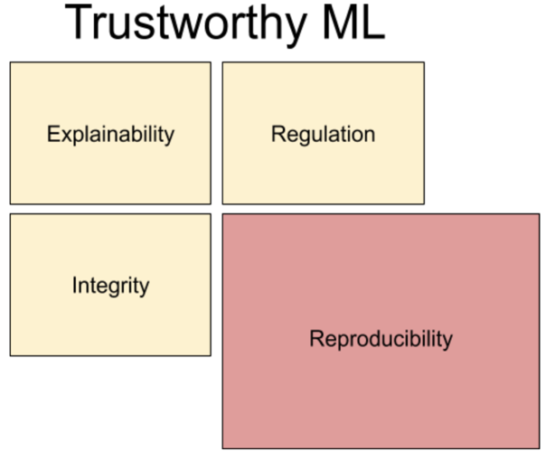

# Reproducibility

[Slides](../slides/Reproducibility.pdf){ .md-button }

  
  

Today is all about reproducibility - one of those concepts that everyone agrees is very important and something should
be done about, but reality is that it is very hard to secure full reproducibility. The last sessions have already
touched a bit on how tools like `conda` and code organization can help make code more reproducible. Today we are going
all the way securing that our scripts and our compute environment is fully reproducible.

## Why does reproducibility matter
Reproducibility is closely related to the scientific method:

> Observe -> Question -> Hypotheses -> Experiment -> Conclude -> Result -> Observe -> ...

Not having reproducible experiments essentially break the cycle at between doing experiments and making conclusions.
If experiments are not reproducible, then we do not expect that others can arrive at the same conclusion as ourself.
As machine learning experiments are fundamentally the same as doing chemical experiments in a laboratory, we should be
equally careful making sure our environments are reproducible (think of your laptop as your laboratory).

Secondly, if we focus on why reproducibility matters especially to machine learning, it is part of the bigger challenge
of making sure that machine learning is **trustworthy**.

<figure markdown>
  { width="600" }
  <figcaption> <a href="https://towardsdatascience.com/reproducible-machine-learning-cf1841606805"> Image credit </a> </figcaption>
</figure>

Trustworthy ML is basically the idea that machine learning agents *can* be trusted. Take the example of a machine
learning agent being responsible for medical diagnoses. It is s very clear that we need to be able to trust that the
agent give us the correct diagnosis for the system to work in practice. Reproducibility plays a big role here,
because without we cannot be sure that the exact same agent deployed at two different hospitals will actually give
the same diagnosis (given the same input).

!!! tip "Learning objectives"

    The learning objectives of this session are:

    * To understand the importance of reproducibility in computer science
    * To be able to use `docker` to create a reproducible containers
    * Understand different ways of configuring your code and how to use `hydra` to integrate with config files
