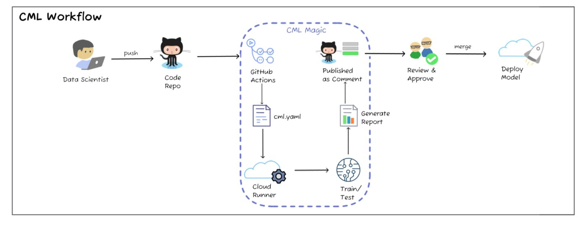

{ align=right width="130"}

# Continuous Machine Learning

---

The continuous integration we have looked at until now is what we can consider "classical" continuous integration, that
have its roots in DevOps and not MLOps. While the test that we have written and the containers ww have developed in the
previous session have be around machine learning, everything we have done translate to completely to how it would be
done if we had developed any other application did not include machine learning.

In this session, we are now gonna change gear and look at **continuous machine learning** (CML). As the name may suggest
we are now focusing on automatizing actual machine learning processes. You may ask why we need continuous integration
principals baked into machine learning pipelines? The reason is the same as with any continuous integration, namely that
we have a bunch of checks that we want our newly trained model to pass before we trust it. Writing `unittests` secures
that our code is not broken, but there are other failure modes of a machine learning pipeline that should be checked
before the model is ready for deployment:

* Did I train on the correct data?
* Did my model converge at all?
* Did it reach a certain threshold at all?

Answering these questions in a continuous way are possible through continuous machine learning. For this session, we are
going to use `cml` by [iterative.ai](https://iterative.ai/) for this session. Strictly speaking, using the
`cml` framework is not a necessary component for doing continuous machine learning but it streamlined way of doing this
and offers tools to easily get a report about how a specific run performed. If we where just interested in trigging
model training every time we do a `git push` we essentially just need to include

```yaml
run: python train.py
```

to any of our workflow files.

The figure below describes the overall process using the `cml` framework. It should be clear that it is the very
same process that we go through as in the other continuous integration sessions: `push code` -> `trigger GitHub actions`
-> `do stuff`. The new part in this session is that we want an report of the finding of the automated run to appear
after the run is done.

<figure markdown>
{ width="1000" }
<figcaption>
<a href="https://towardsdatascience.com/continuous-machine-learning-e1ffb847b8da"> Image credit </a>
</figcaption>
</figure>

## ❔ Exercises

1. We are first going to revisit our `train.py` script. If we want `cml` to automatically be able
    to report the performance of our trained model to us after it is trained, we need to give it some
    statistics to work with. Below is some psedo-code that computes the accuracy and the confusion
    matrix of our trained model. Create an copy of your training script (call it `train_cml.py`) and
    make sure your script is also producing an classification report and confusion matrix as in the
    pseudo-code.

    ```python
    # assume we have a trained model
    import matplotlib.pyplot as plt
    from sklearn.metrics import classification_report, confusion_matrix, ConfusionMatrixDisplay
    preds, target = [], []
    for batch in train_dataloader:
        x, y = batch
        probs = model(x)
        preds.append(probs.argmax(dim=-1))
        target.append(y.detach())

    target = torch.cat(target, dim=0)
    preds = torch.cat(preds, dim=0)

    report = classification_report(target, preds)
    with open("classification_report.txt", 'w') as outfile:
        outfile.write(report)
    confmat = confusion_matrix(target, preds)
    disp = ConfusionMatrixDisplay(confusion_matrix = confmat)
    plt.savefig('confusion_matrix.png')
    ```

2. Similar to what we have looked at until now, automation happens using *github workflow* files.
    The main difference from continuous integration we have looked on until now, is that we are actually
    going to *train* our model whenever we do a `git push`. Copy the following code into a new workflow
    (called `cml.yaml`) and add that file to the folder were you keep your workflow files.

    ```yaml
    name: train-my-model
    on: [push]
    jobs:
      run:
        runs-on: [ubuntu-latest]
        steps:
          - uses: actions/checkout@v2
          - uses: iterative/setup-cml@v1
          - name: Train model
            run: |
              pip install -r requirements.txt  # install dependencies
              python train.py  # run training
          - name: Write report
            env:
              # this authenticates that the right permissions are in place
              REPO_TOKEN: ${{ secrets.GITHUB_TOKEN }}
            run: |
              # send all information to report.md that will be reported to us when the workflow finish
              cat classification_report.txt >> report.md
              cml-publish confusion_matrix.png --md >> report.md
              cml-send-comment report.md
    ```

    Nearly everything in the workflow file should look familiar, except the last two lines.

3. Try pushing the workflow file to your GitHub repository and make sure that it completes.
    If it does not, you may need to adjust the workflow file slightly.

4. Send yourself a pull-request. I recommend seeing [this](https://www.youtube.com/watch?v=xwyJexAnt9k)
    very short video on how to send yourself a pull-request with a small change. If you workflow file is
    executed correctly you should see `github-actions` commenting with a performance report on your PR.

5. (Optional) `cml` is offered by the same people behind `dvc` and it should therefore come as no surprise
    that these features can interact with each other. If you want to deep dive into this,
    [here](https://cml.dev/doc/cml-with-dvc) is a great starting point.

The ends the session on continuous machine learning. If you have not already noticed, one limitation of using github
actions is that their default runners e.g. `runs-on: [ubuntu-latest]` are only CPU machines (see
[hardware config](https://docs.github.com/en/actions/using-github-hosted-runners/about-github-hosted-runners#supported-runners-and-hardware-resources)
. As we all know, modern machine learning more or less requires hardware acceleration (=GPUs) to train within
reasonable time. Luckily for us `cml` also integrated with large cloud provides and I therefore recommend that
after doing through the modules on [cloud computing](../s6_the_cloud/README.md) that you return to this exercise and
experiment with setting up [self-hosted runners](https://github.com/iterative/cml#advanced-setup).
