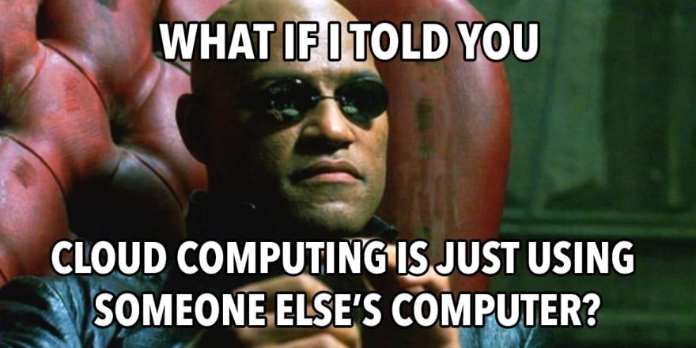

# Cloud computing

[Slides](../slides/Cloud%20Intro.pdf){ .md-button }

- {align=right : style="height:100px;width:100px"}

    Learn how to get started with Google Cloud Platform and how to interact with the SDK.

    [:octicons-arrow-right-24: M19: Cloud Setup](cloud_setup.md)

- {align=right : style="height:100px;width:100px"}

    Learn how to use different GCP services to support your machine learning pipeline.

    [:octicons-arrow-right-24: M20: Cloud Services](using_the_cloud.md)

Running computations locally is often sufficient when only playing around with code in the initial phase of development.
However, to scale your experiments you will need more computing power than what your standard laptop/desktop can offer.
You probably already have experience with running on a local cluster or similar but today's topic is about utilizing
cloud computing.

<!-- markdownlint-disable -->
<figure markdown>
{ width="600" }
<figcaption>
<a href="https://towardsdatascience.com/how-to-start-a-data-science-project-using-google-cloud-platform-6618b7c6edd2"> Image credit </a>
</figcaption>
</figure>
<!-- markdownlint-restore -->

There exist [numerous](https://github.com/zszazi/Deep-learning-in-cloud) amount of cloud computing providers with some
of the biggest being:

- Azure
- AWS
- Google Cloud project
- Alibaba Cloud

They all have slight advantages and disadvantages over each other. In this course, we are going to focus on Google
Cloud, because they have been kind enough to sponsor $50 of cloud credit to each student. If you happen to run out of
credit, you can also get some free credit for a limited amount of time when you sign up with a new account. What's
important to note is that all these different cloud providers all have the same set of services and that learning how to
use the services of one cloud provider in many cases translates to also knowing how to use the same services at another
cloud provider. The services are called something different and can have a bit of a different interface/interaction
pattern but in the end, it does not matter.

Today's exercises are about getting to know how to work with the cloud. If you are in doubt about anything or want to
deep dive into some topics, I can recommend watching this
[series of videos](https://www.youtube.com/watch?v=4D3X6Xl5c_Y&list=PLIivdWyY5sqKh1gDR0WpP9iIOY00IE0xL)
or going through the [general docs](https://cloud.google.com/docs).

!!! tip "Learning objectives"

    The learning objectives of this session are:

    * In general being familiar with the Google SDK working
    * Being able to start different compute instances and work with them
    * Know how to do continuous integration workflows for the building of docker images
    * Knowledge about how to store data and containers/artifacts in cloud buckets
    * Being able to train simple deep-learning models using a combination of cloud services
