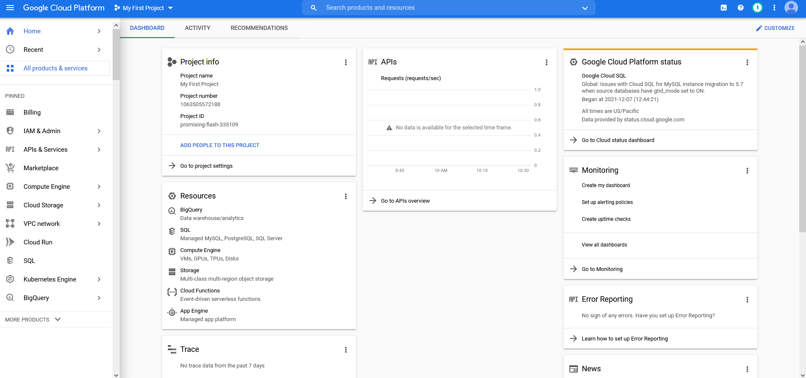
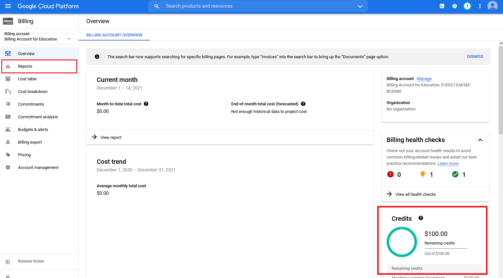

# Cloud setup

---

!!! info "Core Module"

Google cloud project (GCP) is the cloud service provided by Google. The key concept, or selling point, of any cloud
provider is the idea of near-infinite resources. Without the cloud it simply is not feasible to do many modern
deep learning and machine learning tasks because they cannot be scaled locally.

The image below shows a subset of [all the different services](https://cloud.google.com/products) that the Google cloud
platform offers. The ones marked in red are the ones we are actually going to investigate in this course. Therefore, if
you get done with exercises early I highly recommend that you deep dive more into the Google cloud platform.

<figure markdown>
{ width="800"  }
<figcaption> <a href="https://www.pintonista.com/google-cloud-platform-intro/"> Image credit </a> </figcaption>
</figure>

## ❔ Exercises

As the first step we are going to get you setup with some Google cloud credits.

1. Go to <https://learn.inside.dtu.dk>. Go to this course. Find the recent message where there should be a download
    link and instructions on how to claim the $50 cloud credit. Please do not share the link anywhere as there are a
    limited amount of coupons. If you are not officially taking this course at DTU, Google gives $300 cloud credits
    whenever you signup with a new account. NOTE that you need to provide a credit card for this so make
    sure to closely monitor your credit use so you do not end spending more than the free credit.

2. Login to the homepage of gcp. It should look like this:

    <figure markdown>
    { width="800"  }
    </figure>

3. Go to billing and make sure that your account is showing $50 of cloud credit

    <figure markdown>
    { width="800"  }
    </figure>

    make sure to also checkout the `Reports` throughout the course. When you are starting to use some of the cloud
    services these tabs will update with info about how much time you can use before your cloud credit runs out.
    Make sure that you monitor this page as you will not be given another coupon.

4. One way to stay organized within GCP is to create projects.

    <figure markdown>
        { width="800"  }
    </figure>

    Create a new project called `dtumlops`. When you click `create` you should get a notification that the project
    is being created. The notification bell is good way to make sure how the processes you are running are doing
    throughout the course.

5. Finally, for setup we are going to install `gcloud`. `gcloud` is the command line interface for working with
    our Google cloud account. Nearly everything that we can do through the web interface we can also do through
    the `gcloud` interface. Follow the installation instructions [here](https://cloud.google.com/sdk/docs/install)
    for your specific OS.

    1. After installation, try in a terminal to type:

        ```bash
        gcloud -h
        ```

        the command should and show the help page. If not, something went wrong in the installation
        (you may need to restart after installing).

    2. Now login by typing

        ```bash
        gcloud auth login
        ```

        you should be sent to an web page where you link your cloud account to the `gcloud` interface.
        Afterwards, also run this command:

        ```bash
        gcloud auth application-default login
        ```

        If you at some point want to revoke this you can type:

        ```bash
        gcloud auth revoke
        ```

    3. Next you will need to set the project that we just created. In your web browser under project info,
        you should be able to see the `Project ID` belonging to your `dtumlops` project. Copy this an type
        the following command in a terminal

        ```bash
        gcloud config set project <project-id>
        ```

        You can also get the project info by running

        ```bash
        gcloud projects list
        ```

    4. Next install the Google cloud python API:

        ```bash
        pip install --upgrade google-api-python-client
        ```

        Make sure that the python interface is also installed. In a python terminal type

        ```python
        import googleapiclient
        ```

        this should work without any errors.

    5. Finally, we need some additional commands for `gcloud` which are part of the `beta` component.
        Install with:

        ```bash
        gcloud components install beta
        ```

        You can get a list of all install components using

        ```bash
        gcloud components list
        ```

    6. (Optional) If you are using VSCode you can also download the relevant
        [extension](https://marketplace.visualstudio.com/items?itemName=GoogleCloudTools.cloudcode)
        called `Cloud Code`. After installing it you should see a small `Cloud Code` button in the action bar.

After following these step your laptop should hopefully be setup for using `gcp` locally. You are now ready to use their
services, both locally on your laptop and in the cloud console.

## Quotas

A big part of using the cloud in a bigger organisation has to do with Admin and quotas. Admin here in general refers
to the different roles that users of GCP and quotas refers to the amount of resources that a given user has access to.
For example one employee, lets say a data scientist, may only be granted access to certain GCP services that have to do
with development and training of machine learning model, with `X` amounts of GPUs available to use to make sure that the
employee does not spend too much money. Another employee, a devops engineer, probably do not need access to the same
services and not necessarily the same resources.

In this course we are not going to focus too much on this aspect but it is important to know about. What we are going
to go through is how to increase the quotas for how many GPUs you have available. By default any free accounts in GCP
(or accounts using teaching credits) the default quota for GPUs that you can use is either 0 or 1 (their policies
sometimes changes). We will in the exercises below try to increase it.

### ❔ Exercises

1. Start by enabling the `Compute Engine` service. Simply search for it in the top search bar. It should bring you
    to the a page where you can enable the service (may take some time). We are going to look more into this service
    in the next module.

2. Next go to the `IAM & Admin` page, again search for it in the top search bar. The remaining steps are illustrated
    in the figure below.

    1. Go to the `quotas page`

    2. In the search field search for `GPUs (all regions)` (needs to match exactly, the search field is case sensitive),
        such that you get the same quota as in the image.

    3. In the limit you can see what your current quota for the number of GPUs you can use are. Additional, to the
        right of the limit you can see the current usage. It is worth checking in on if you are ever in doubt if a job
        is running on GPU or not.

    4. Click the quota and afterwards the `Edit qoutas` button.

    5. In the pop-op window, increase your limit to either 1 or 2.

    6. After sending your request you can try clicking the `Increase requests` tab to see the status of your request

    <figure markdown>
        { width="1000" }
    </figure>

If you are ever running into errors when working in GPU that contains statements about `quotas` you can always try to
go to this page and see what you are actually allowed to use currently and try to increase it.

Finally, we want to note that a quota increase is sometimes not allowed within 24 hours of creating an account. If your
request gets rejected, we recommend to wait a day and try again. If this does still not work, you may need to use their
services some more to make sure you are not a bot that wants to mine crypto.

## 🧠 Knowledge check

??? question "Knowledge question 1"

    What considerations to take when choosing an GCP region for running a new application?

    ??? success "Solution"

        A series of factors may influence your choice of region, including:

        * Services availability in the region, not all services are available in all regions
        * Reduced latency: if your application is running in the same region as your users, the latency will be lower
        * Compliance: some countries has strict rules that requires user info to be stored inside a particular region
            eg. EU has GDPR rules that requires all user data to be stored in the EU
        * Pricing: some regions may have different pricing than others
