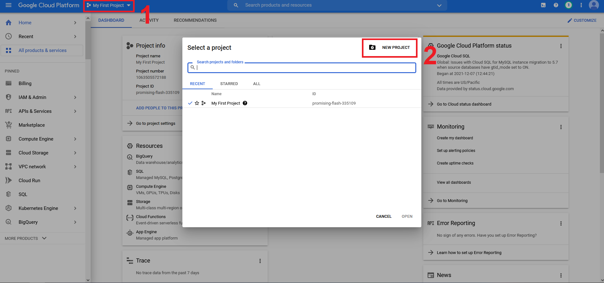
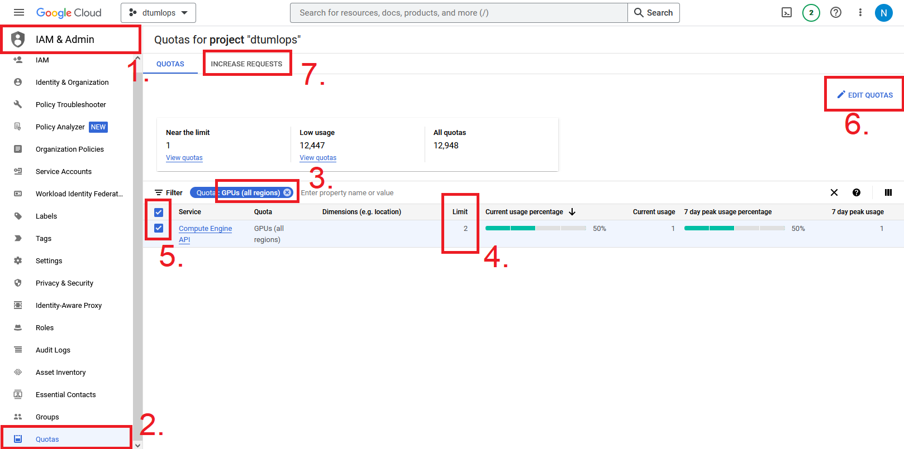

# Cloud setup

---

!!! info "Core Module"

Google Cloud Platform (GCP) is the cloud service provided by Google. The key concept, or selling point, of any cloud
provider, is the idea of near-infinite resources. Without the cloud, it simply is not feasible to do many modern
deep learning and machine learning tasks because they cannot be scaled locally.

The image below shows [all the different services](https://cloud.google.com/products) that the Google Cloud platform
offers. We are going to be working with around 10 of these services throughout the course. Therefore, if you get done
with exercises early I highly recommend that you deep dive more into the Google cloud platform.

<figure markdown>
{ width="1000"  }
<figcaption> <a href="https://github.com/priyankavergadia/google-cloud-4-words"> Image credit </a> </figcaption>
</figure>

## ❔ Exercises

As the first step, we are going to get you some Google Cloud credits.

1. Go to <https://learn.inside.dtu.dk>. Go to this course. Find the recent message where there should be a download
    link and instructions on how to claim the $50 cloud credit. Please do not share the link anywhere as there are a
    limited amount of coupons. If you are not officially taking this course at DTU, Google gives $300 cloud credits
    whenever you sign up with a new account. NOTE that you need to provide a credit card for this so make
    sure to closely monitor your credit use so you do not end up spending more than the free credit.

2. Log in to the homepage of GCP. It should look like this:

    <figure markdown>
    { width="800"  }
    </figure>

3. Go to billing and make sure that your account is showing $50 of cloud credit

    <figure markdown>
    { width="800"  }
    </figure>

    make sure to also check out the `Reports` throughout the course. When you are starting to use some of the cloud
    services these tabs will update with info about how much time you can use before your cloud credit runs out.
    Make sure that you monitor this page as you will not be given another coupon.

4. One way to stay organized within GCP is to create projects.

    <figure markdown>
        { width="800"  }
    </figure>

    Create a new project called `dtumlops`. When you click `create` you should get a notification that the project
    is being created. The notification bell is a good way to make sure how the processes you are running are doing
    throughout the course.

5. Next, it local setup on your laptop. We are going to install `gcloud`, which is part of the Google Cloud SDK.
    `gcloud` is the command line interface for working with our Google Cloud account. Nearly everything that we can do
    through the web interface we can also do through the `gcloud` interface. Follow the installation instructions
    [here](https://cloud.google.com/sdk/docs/install) for your specific OS.

    1. After installation, try in a terminal to type:

        ```bash
        gcloud -h
        ```

        the command should show the help page. If not, something went wrong in the installation (you may need to
        restart after installing).

    2. Now login by typing

        ```bash
        gcloud auth login
        ```

        you should be sent to a web page where you link your cloud account to the `gcloud` interface. Afterward, also
        run this command:

        ```bash
        gcloud auth application-default login
        ```

        If you at some point want to revoke the authentication you can type:

        ```bash
        gcloud auth revoke
        ```

    3. Next, you will need to set the project that we just created as the default project0. In your web browser under
        project info, you should be able to see the `Project ID` belonging to your `dtumlops` project. Copy this and
        type he following command in a terminal

        ```bash
        gcloud config set project <project-id>
        ```

        You can also get the project info by running

        ```bash
        gcloud projects list
        ```

    4. Next, install the Google Cloud Python API:

        ```bash
        pip install --upgrade google-api-python-client
        ```

        Make sure that the Python interface is also installed. In a Python terminal type

        ```python
        import googleapiclient
        ```

        this should work without any errors.

    5. (Optional) If you are using VSCode you can also download the relevant
        [extension](https://marketplace.visualstudio.com/items?itemName=GoogleCloudTools.cloudcode)
        called `Cloud Code`. After installing it you should see a small `Cloud Code` button in the action bar.

6. Finally, we need to activate a couple of
    [developer APIs](https://cloud.google.com/api-gateway/docs/configure-dev-env#prerequisites) that are not activated
    by default. In a terminal write

    ```bash
    gcloud services enable apigateway.googleapis.com
    gcloud services enable servicemanagement.googleapis.com
    gcloud services enable servicecontrol.googleapis.com
    ```

    you can always check which services are enabled by typing

    ```bash
    gcloud services list
    ```

After following these steps your laptop should hopefully be setup for using GCP locally. You are now ready to use their
services, both locally on your laptop and in the cloud console.

## IAM and Quotas

A big part of using the cloud in a bigger organization has to do with Admin and quotas. Admin here in general refers
to the different roles that users of GCP and quotas refer to the amount of resources that a given user has access to.
For example, one employee, let's say a data scientist, may only be granted access to certain GCP services that have to
do with the development and training of machine learning models, with `X` amounts of GPUs available to use to make sure
that the employee does not spend too much money. Another employee, a DevOps engineer, probably does not need access to
the same services and not necessarily the same resources.

In this course, we are not going to focus too much on this aspect but it is important to know that it exists. One
feature you are going to need for doing the project is how to share a project with other people. This is done through
the IAM (Identities and Access Management) page. Simply click the `Grant Access` button, search for the email of the
person you want to share the project with and give them either `Viewer`, `Editor` or `Owner` access, depending on what
you want them to be able to do. The figure below shows how to do this.

<figure markdown>
{ width="1000" }
</figure>

What we are going to go through right now is how to increase the quotas for how many GPUs you have available for your
project. By default, for any free accounts in GCP (or accounts using teaching credits) the default quota for GPUs that
you can use is either 0 or 1 (their policies sometimes change). We will in the exercises below try to increase it.

### ❔ Exercises

1. Start by enabling the `Compute Engine` service. Simply search for it in the top search bar. It should bring you
    to a page where you can enable the service (may take some time). We are going to look more into this service
    in the next module.

2. Next go to the `IAM & Admin` page, again search for it in the top search bar. The remaining steps are illustrated
    in the figure below.

    1. Go to the `quotas page`

    2. In the search field search for `GPUs (all regions)` (needs to match exactly, the search field is case sensitive),
        such that you get the same quota as in the image.

    3. In the limit, you can see what your current quota for the number of GPUs you can use is. Additionally, to the
        right of the limit, you can see the current usage. It is worth checking in on if you are ever in doubt if a job
        is running on GPU or not.

    4. Click the quota and afterward the `Edit` quotas button.

    5. In the pop-up window, increase your limit to either 1 or 2.

    6. After sending your request you can try clicking the `Increase requests` tab to see the status of your request

    <figure markdown>
        { width="1000" }
    </figure>

If you are ever running into errors when working in GPU that contains statements about `quotas` you can always try to
go to this page and see what you are allowed to use currently and try to increase it. For example, when you get to
training machine learning models using Vertex AI in the [next module](using_the_cloud.md), you would most likely
need to ask for a quota increase for that service as well.

<figure markdown>
{ width="1000" }
</figure>

Finally, we want to note that a quota increase is sometimes not allowed within 24 hours of creating an account. If your
request gets rejected, we recommend to wait a day and try again. If this does still not work, you may need to use their
services some more to make sure you are not a bot that wants to mine crypto.

## Service accounts

At some point, you will most likely need to use a service account. A service account is a virtual account that is used
to interact with the Google Cloud API. It it intended for non-human users e.g. other machines, services, etc. For
example, if you want to launch a training job from GitHub Actions, you will need to use a service account for
authentication between GitHub and GCP. You can read more about how to create a service account
[here](https://cloud.google.com/iam/docs/creating-managing-service-accounts).

### ❔ Exercises

1. Go to the `IAM & Admin` page and click on `Service accounts`. Alternatively, you can search for it in the top search
    bar.

2. Click the `Create Service Account` button. On the next page, you can give the service account a name, and id (
    automatically generated, but you can change it if you want). You can also give it a description. Leave the rest as
    default and click `Create`.

3. Next, let's give the service account some permissions. Click on the service account you just created. In the
    `Permissions` tab click `Add permissions`. Your job now is to give the service account the lowest possible
    permissions such that it can download files from a bucket. Look at this
    [page](https://cloud.google.com/iam/docs/understanding-roles) and try to find the role that fits the description.

    ??? success "Solution"

        The role you are looking for is `Storage Object Viewer`. This role allows the service account to list objects
        in a bucket and download objects, but nothing more. Thus even if someone gets access to the service account
        they cannot delete objects in the bucket.

4. To use the service account later we need to create a key for it. Click on the service account and then the `Keys`
    tab. Click `Add key` and then `Create new key`. Choose the `JSON` key type and click `Create`. This will download
    a JSON file to your computer. This file is the key to the service account and should be kept secret. If you lose
    it you can always create a new one.

5. Finally, everything we just did from creating the service account, giving it permissions, and creating a key can
    also be done through the `gcloud` interface. Try to find the commands to do this in the
    [documentation](https://cloud.google.com/sdk/gcloud/reference/iam/service-accounts).

    ??? success "Solution"

        The commands you are looking for are:

        ```bash
        gcloud iam service-accounts create my-sa \
            --description="My first service account" --display-name="my-sa"
        gcloud projects add-iam-policy-binding $(GCP_PROJECT_NAME) \
            --member="serviceAccount:global-service-account@iam.gserviceaccount.com" \
            --role="roles/storage.objectViewer"
        gcloud iam service-accounts keys create service_account_key.json \
            --iam-account=global-service-account@$(GCP_PROJECT_NAME).iam.gserviceaccount.com
        ```

        where `$(GCP_PROJECT_NAME)` is the name of your project. If you then want to delete the service account you can
        run

        ```bash
        gcloud iam service-accounts delete global-service-account@$(GCP_PROJECT_NAME).iam.gserviceaccount.com
        ```

## 🧠 Knowledge check

1. What considerations to take when choosing a GCP region for running a new application?

    ??? success "Solution"

        A series of factors may influence your choice of region, including:

        * Services availability in the region, not all services are available in all regions
        * Resource availability: [some regions](https://cloud.google.com/compute/docs/gpus/gpu-regions-zones) have more
            GPUs available than others
        * Reduced latency: if your application is running in the same region as your users, the latency will be lower
        * Compliance: some countries have strict rules that require user info to be stored inside a particular region
            eg. EU has GDPR rules that require all user data to be stored in the EU
        * Pricing: some regions may have different pricing than others

2. The 3 major cloud providers all have the same services, but they are called something different depending on the
    provider. What are the corresponding names of these GCP services in AWS and Azure?

    * Compute Engine
    * Cloud storage
    * Cloud functions
    * Cloud run
    * Cloud build
    * Vertex AI

    It is important to know these correspondences to navigate blogpost etc. about MLOps on the internet.

    ??? success "Solution"

        GCP             | AWS                         | Azure
        ----------------|-----------------------------|------
        Compute Engine  | Elastic Compute Cloud (EC2) | Virtual Machines
        Cloud storage   | Simple Storage Service (S3) | Blob Storage
        Cloud functions | Lambda                      | Functions Serverless Compute
        Cloud run       | App Runner, Fargate, Lambda | Container Apps, Container Instances
        Cloud build     | CodeBuild                   | DevOps
        Vertex AI       | SageMaker                   | AI Platform

3. Why does is it always important to assign the lowest possible permissions to a service account?

    ??? success "Solution"

        The reason is that if someone gets access to the service account they can only do what the service account is
        allowed to do. If the service account has the permission to delete objects in a bucket, the attacker can delete
        all the objects in the bucket. For this reason, in most cases multiple service accounts are used, each with
        different permissions. This setup is called the
        [principle of least privilege](https://en.wikipedia.org/wiki/Principle_of_least_privilege).
