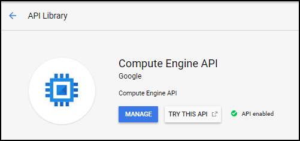
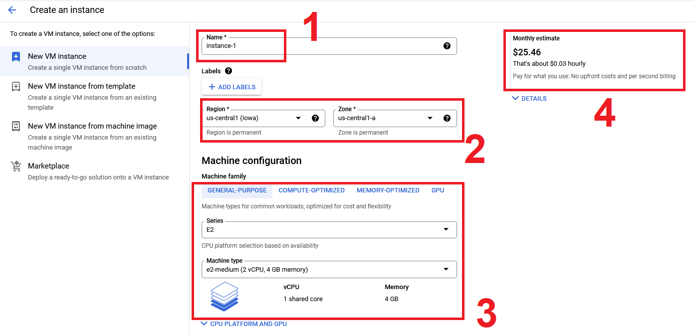
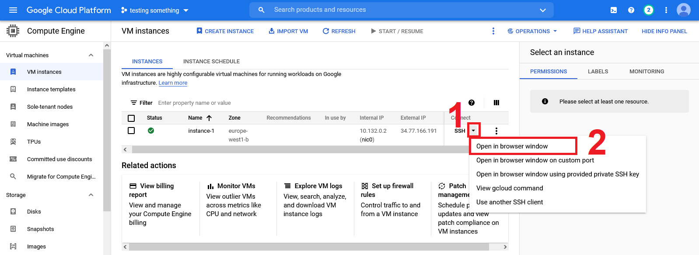
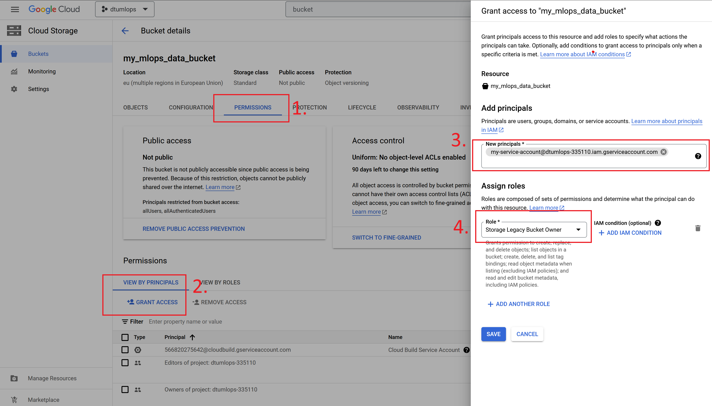
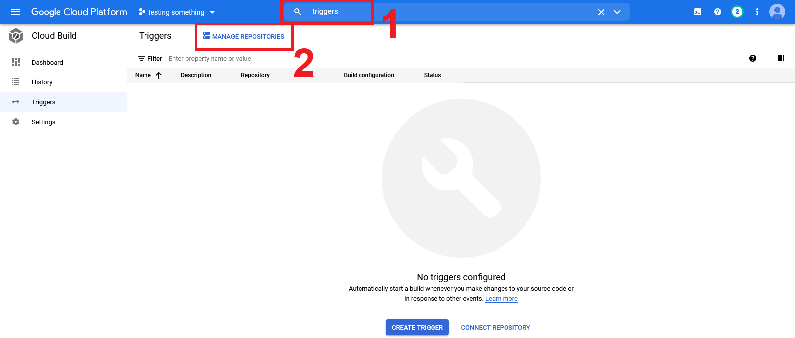
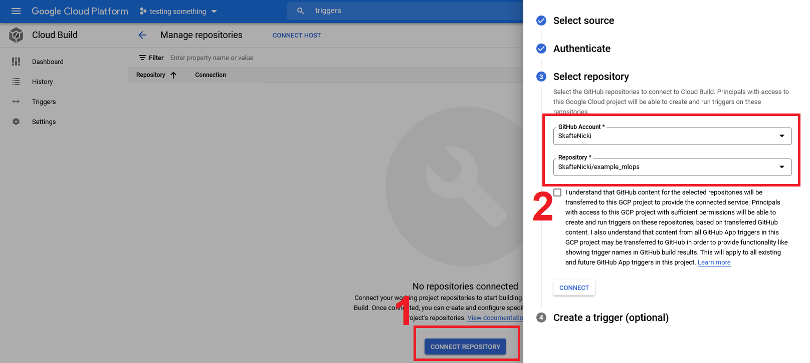

# Using the cloud

---

!!! info "Core Module"

In this set of exercises we are going to get more familiar with the using some of the resources that
the Google cloud project offers.

## Compute

The most basic service of any cloud provider is the ability to create and run virtual machines.
In `gcp` this service is called [Compute Engine API](https://cloud.google.com/compute/docs/reference/rest/v1).
A virtual machine allows you to essentially run an operating system that behaves like a completely separate computer.
There are many reasons why one to use virtual machines:

* Virtual machines allow you to scale your operations, essentially giving you access to infinitely many individual
    computers
* Virtual machines allow you to use large scale hardware. For example if you are developing an deep learning model on
    your laptop and want to know the inference time for a specific hardware configuration, you can just create a virtual
    machine with those specs and run your model.

* Virtual machines allow you to run processes in the "background". If you want to train a model for a week or more, you
    do not want to do this on your own laptop as you cannot really move it or do anything with while it is training.
    Virtual machines allow you to just launch a job and forget about it (at least until you run out of credit).

<figure markdown>
{ width="800"  }
</figure>

### ❔ Exercises

We are now going to start actually using the cloud.

1. Click on the `Compute Engine` tab in sidebar on the homepage of `gcp`.

2. Try to `Create instance`. You will see the following image below.

    <figure markdown>
    { width="800"  }
    </figure>

    Give it a meaningful name, set the location to some location that is closer to where you actually is (to reduce
    latency). Finally try to adjust the the configuration a bit. What two factors are effecting the price of the compute
    unit?

3. After figuring this out, create a `e2-medium` instance (leave rest configured as default). Before clicking the
    `Create` button make sure to check the `Equavalent Command Line` button. You should see a very long command that you
    could have typed instead to do the exact same.

4. Now in a local terminal type:

    ```bash
    gcloud compute instances list
    ```

    you should hopefully see the instance you have just created.

5. You can start a terminal directly by typing:

    ```bash
    gcloud beta compute ssh --zone <zone> <name> --project <project-id>
    ```

    You can always see the exact command that you need to run to `ssh` to an VM by selecting the
    `View gcloud command` option in the Compute Engine overview (see image below).

    <figure markdown>
    { width="800"  }
    </figure>

6. While logged into the instance, check if Python and Pytorch is installed?
    You should see that neither is installed. The VM we have only specified what
    compute resources it should have, and not what software should be in it. We
    can fix this by starting VMs based on specific docker images (its all coming together).

    1. `gcp` Comes with a number of ready-to-go images for doing deep learning.
        More info can be found [here](https://cloud.google.com/deep-learning-containers/docs/choosing-container).
        Try, running this line:

        ```bash
        gcloud container images list --repository="gcr.io/deeplearning-platform-release"
        ```

        what does the output show?

    2. Next, start (in the terminal) a new instance using a Pytorch image. The
        command for doing it should look something like this:

        ```bash
        gcloud compute instances create <instance_name> \
            --zone=<zone> \
            --image-family=<image-family> \
            --image-project=deeplearning-platform-release \
        ```

        You can find more info [here](https://cloud.google.com/deep-learning-vm/docs/pytorch_start_instance) on what
        `<image-family>` should have as value and what extra argument you need to add if you want to run on GPU (if you
        have access).

    3. `ssh` to the VM as one of the previous exercises. Confirm that the container indeed contains
        both a python installation and Pytorch is also installed. Hint: you also have the possibility
        through the web page to start a browser session directly to the VMs you create:

        <figure markdown>
        { width="800" }
        </figure>

7. Finally, everything that you have done locally can also be achieved through the web
    terminal, which of course comes pre-installed with the `gcloud` command etc.

    <figure markdown>
    { width="800"  }
    </figure>

    Try out launching this and run some of the commands from the previous exercises.

## Data storage
Another big part of cloud computing is storage of data. There are many reason that you want to store your
data in the cloud including:

* Easily being able to share
* Easily expand as you need more
* Data is stored multiple locations, making sure that it is not lost in case of an emergency

Cloud storage is luckily also very cheap. Google cloud only takes around $0.026 per GB per month.
This means that around 1 TB of data would cost you $26 which is more than what the same amount of
data would cost on Goggle Drive, but the storage in Google cloud is much more focused on enterprise
where you have a need for accessing data through an API.

### ❔ Exercises
When we did the exercise on data version control, we made `dvc` work together with our own Google
drive to storage data. However, a big limitation of this is that we need to authentic each time we
try to either push or pull the data. The reason is that we need to use an API instead which is
offered through `gcp`.

We are going to follow the instructions from this [page](https://dvc.org/doc/user-guide/setup-google-drive-remote)

1. Lets start by creating a data storage. On the GCP startpage, in the sidebar, click on the `Cloud Storage`.
    On the next page click the `Create bucket`:

    <figure markdown>
    { width="800" }
    </figure>

    Give the bucket an unique name, set it to a region close by and importantly remember to enable *Object versioning*
    under the last tab. Finally click `Create`.

2. After creating the storage, you should be able to see it online and you should be able to see it if you type in your
    local terminal:

    ```bash
    gsutil ls
    ```

    `gsutil` is an additional command to `gcloud`, that provides more command line options.

3. Next we need the Google storage extension for `dvc`

    ```bash
    pip install dvc[gs]
    ```

4. Now in your MNIST repository where you have already configured dvc, we are going to change the storage
    from our Google drive to our newly created Google cloud storage.

    ```bash
    dvc remote add -d remote_storage <output-from-gsutils>
    ```

    In addition we are also going to modify the remote to support object versioning (called `version_aware` in `dvc`):

    ```bash
    dvc remote modify remote_storage version_aware true
    ```

    This will change the default way that `dvc` handles data. Instead of just storing the latest version of the data as
    [content-addressable storage](https://dvc.org/doc/user-guide/project-structure/internal-files#structure-of-the-cache-directory)
    it will now store the data as it looks in our local repository, which allows us to not only use `dvc` to download
    our data.

5. The above command will change the `.dvc/config` file. `git add` and `git commit` the changes to that file.
    Finally, push data to the cloud

    ```bash
    dvc push
    ```

6. Finally, make sure that you can pull without having to give your credentials. The easiest way to see this
    is to delete the `.dvc/cache` folder that should be locally on your laptop and afterwards do a `dvc pull`.

This setup should work when trying to access the data from your laptop, which we authenticated in the previous module.
However, how can you access the data from a virtual machine, inside a docker container or from a different laptop? We
in general recommend two ways:

* You can make the bucket public accessible e.g. no authentication needed. That means that anyone with the url to the
    data can access it. This is the easiest way to do it, but also the least secure. You can read more about how to make
    your buckets public [here](https://cloud.google.com/storage/docs/access-control/making-data-public).

* You can create a [service account](https://cloud.google.com/iam/docs/service-account-overview) which is a more secure
    way of accessing data. A service account is essentially a second user which you can give access to specific
    services. You can read more about how to create a service account
    [here](https://cloud.google.com/iam/docs/creating-managing-service-accounts). Once you have created a service
    account you can give it access to a specific bucket by going to the `Permissions` tab of the bucket and add the
    service account as a member.

    <figure markdown>
    { width="800" }
    </figure>

    If you need to authenticate your service account from a VM, you can do it by running the following command:

    ```bash
    gcloud auth activate-service-account --key-file=<key-file>
    ```

    where the `<key-file` is the json file that you downloaded when you created the service account (DO NOT SHARE THIS).

## Artifact registry

You should hopefully at this point have seen the strength of using containers to create reproducible environments. They
allow us to specify exactly the software that we want to run inside our VMs. However, you should already have run into
two problems with containers

* Building process can take a lot of time
* Docker images can be large

For this reason we want to move both the building process and the storage of images to the cloud. In GCP the service
for this is called [Artifact registry](https://cloud.google.com/artifact-registry), formerly known as Container
registry.

### ❔ Exercises

For the purpose of these exercise I recommend that you start out with a dummy version of some code to make sure
that the building process do not take too long. You are more than free to **fork**
[this repository](https://github.com/SkafteNicki/gcp_docker_example). The repository contains a simple python
script that does image classification using sklearn. The docker images for this application are therefore going
to be substantially faster to build and smaller in size than the images we are used to that uses Pytorch.

1. Start by enabling the service: `Google Artifact Registry API` and `Google Cloud Build API`. This can be
    done through the web side (by searching for the services) or can also be enabled from the terminal:

    ```bash
    gcloud services enable artifactregistry.googleapis.com
    gcloud services enable cloudbuild.googleapis.com
    ```

2. Google cloud building can in principal work out of the box with docker files. However, the recommended way
    is to add specialized `cloudbuild.yaml` files. They should look something like this:

    ```yaml
    steps:
        - name: 'gcr.io/cloud-builders/docker'
            args: ['build', '-t', 'gcr.io/<project-id>/<image-name>', '.']
        - name: 'gcr.io/cloud-builders/docker'
            args: ['push', 'gcr.io/<project-id>/<image-name>']
    ```

    which essentially is a basic yaml file that contains a list of steps, where each step consist of the service
    that should be used and the arguments for that service. In the above example we are calling the same service
    (`cloud-builders/docker`) with different arguments (`build` and then `push`). Implement such a file in your
    repository. Hint: if you forked the repository then you at least need to change the `<project-id>`.

3. From the `gcp` homepage, navigate to the triggers panel:

    <figure markdown>
    { width="800"  }
    </figure>

    Click on the manage repositories.

4. From there, click the `Connect Repository` and go through the steps of authenticating your github profile with
    `gcp` and choose the repository that you want to setup build triggers. For now, skip the
    `Create a trigger (optional)` part by pressing `Done` in the end.

    <figure markdown>
    { width="800"  }
    </figure>

5. Navigate back to the `Triggers` homepage and click `Create trigger`. Set the following:

    * Give a name
    * Event: choose `Push to branch`
    * Source: choose the repository you just connected
    * Branch: choose `^main$`
    * Configuration: choose either `Autodetected` or `Cloud build configuration file`

    Finally click the `Create` button and the trigger should show up on the triggers page.

6. To activate the trigger, push some code to the chosen repository.

7. Go to the `Cloud Build` page and you should see the image being build and pushed.

    <figure markdown>
    { width="800"  }
    </figure>

    Try clicking on the build to checkout the build process and building summary. As you can see from the image, if a
    build is failing you will often find valuable info by looking at the build summary. If you build is failing try
    to configure it to run in one of these regions:
    `us-central1, us-west2, europe-west1, asia-east1, australia-southeast1, southamerica-east1` as specified in the
    [documentation](https://cloud.google.com/build/docs/locations).

8. If/when your build is successful, navigate to the `Artifact Registry` page. You should
    hopefully find that the image you just build was pushed here. Congrats!

9. Finally, to to pull your image down to your laptop

    ```bash
    docker pull gcr.io/<project-id>/<image_name>:<image_tag>
    ```

    you will need to authenticate `docker` with `gcp` first. Instructions can be found
    [here](https://cloud.google.com/container-registry/docs/advanced-authentication), but
    the following command should hopefully be enough to make `docker` and `gcp` talk to
    each other:

    ```bash
    gcloud auth configure-docker
    ```

    Note: To do this you need to have `docker` actively running in the background, as any
    other time you want to use `docker`.

10. Automatization through the cloud is in general the way to go, but sometimes you may
    want to manually create images and push them to the registry. Figure out how to push
    an image to your `Container Registry`. For simplicity you can just push the `busybox`
    image you downloaded during the initial docker exercises. This
    [page](https://cloud.google.com/container-registry/docs/pushing-and-pulling) should help
    you with exercise.

## Training

As our final step in our journey through different GCP services in this module we are going to look at training of our
models. This is one of the important tasks that GCP can help us with because we can always rent more hardware as long
as we have credits, meaning that we can both scale horizontal (run more experiments) and vertical (run longer
experiments).

We are going to checkout two ways of running our experiments. First we are going to return to the Compute Engine service
because it gives the most simple form of scaling of experiments. That is: we create a VM with a appropriate docker
image, we start it and login to the VM and we run our experiments. It is possible for most people to run a couple of
experiments in parallel this way. However, what if there was an abstract layer that automatically created VM for us,
lunched our experiments and the close the VM afterwards?

This is where Vertex AI service comes into play. This is a dedicated service for handling ML models in GCP in the cloud.
Vertex AI is in principal and end-to-end service that can take care of everything machine learning related in the cloud.
In this course we are primarily focused on just the training of our models, and then use other services for different
parts of our pipeline.

### ❔ Exercises

1. Lets start by see how we could train a model using Pytorch using the Compute Engine service:

    1. Start by creating a appropriate VM. If you want to start a VM that have Pytorch pre-installed with only CPU
        support you can run the following command

        ```bash
        gcloud compute instances create <instance-name> \
            --zone europe-west1-b \
            --image-family=pytorch-latest-cpu \
            --image-project=deeplearning-platform-release
        ```

        alternatively, if you have access to GPU in your GCP account you could start a VM in the following way

        ```bash
        gcloud compute instances create <instance-name> \
            --zone europe-west4-a \
            --image-family=pytorch-latest-gpu \
            --image-project=deeplearning-platform-release \
            --accelerator="type=nvidia-tesla-v100,count=1" \
            --metadata="install-nvidia-driver=True" \
            --maintenance-policy TERMINATE
        ```

    2. Next login into your newly created VM. You can either open an `ssh` terminal in the cloud console or run the
        following command

        ```bash
        gcloud beta compute ssh <instance-name>
        ```

    3. It is recommend to always check that the VM we get is actually what we asked for. In this case the VM should have
        Pytorch pre-installed so lets check for that by running

        ```bash
        python -c "import torch; print(torch.__version__)"
        ```

        Additionally, if you have a VM with GPU support also try running the `nvidia-smi` command.

    4. When you have logged in to the VM, it works as your own machine. Therefore to run some training code you would
        need to do the same setup step you have done on your own machine: clone your github, install dependencies,
        download data, run code. Try doing this to make sure you can train a model.

2. (Optional, may not work as intended) The last step in the previous exercise involves a lot of setup that would be
    necessary to do every time we create a
    new VM, making horizontal scaling of experiments cumbersome. However, we have already developed docker images that
    can take care of most of the setup.

    1. Lets for simplicity just create a very small docker image (called `gcp_vm_tester.dockerfile`) that you can use

        ```dockerfile
        FROM gcr.io/deeplearning-platform-release/pytorch-cpu
        RUN pip install matplotlib
        ```

        this basically just extends the base Pytorch image to also install matplotlib. The important part about the docker
        images that we want to use here is that they should not have an `ENTRYPOINT` at the end, because we do not want
        the docker container to actually run our scripts, just install dependencies on startup.

    2. Lets build docker and manually push it to our container repository in gcp. Build with:

        ```bash
        docker build -f gcp_vm_tester.dockerfile.dockerfile . -t gcp_vm_tester:latest
        ```

        and then push with

        ```bash
        docker tag tester gcr.io/<project-id>/gcp_vm_tester
        docker push gcr.io/<project-id>/gcp_vm_tester
        ```

        confirm by going to the container registry in the cloud console and check that the image has been correctly
        pushed.

    3. Lets then create a VM with that particular docker image. Instead of using `gcloud compute instances create` we
        are now using the `gcloud compute instances create-with-container` command

        ```bash
        gcloud compute instances create-with-container <instance-name> \
            --container-image=gcr.io/<project-id>/gcp_vm_tester
            --zone europe-west1-b
        ```

    4. Confirm that everything works by accessing your newly created VM and run both of these commands

        ```bash
        python -c "import torch; print(torch.__version__)"
        python -c "import matplotlib; print(matplotlib.__version__)"
        ```

3. We are now moving on to the final way to train our code, using `Vertex AI` service.

    1. Start by enabling it by searching for `Vertex AI` in the cloud console and go to the service

    2. The way we are going to use Vertex AI is to create custom jobs because we have already developed docker containers
        that contains everything to run our code. Thus the only command that we actually need to use is
        `gcloud ai custom-jobs create` command. An example here would be:

        ```bash
        gcloud ai custom-jobs create \
            --region=europe-west1 \
            --display-name=test-run \
            --config=config.yaml
        ```

        Essentially, this command combines everything into one command: it first creates a VM with the specs specified by
        a configuration file, then loads a container specified again in the configuration file and finally it runs
        everything. A example of a config file could be:

        ```yaml
        # config_cpu.yaml
        workerPoolSpecs:
            machineSpec:
                machineType: n1-highmem-2
            replicaCount: 1
            containerSpec:
                imageUri: gcr.io/<project-id>/<docker-img>
        ```

        if you only want to run on CPU and another example for GPU:

        ```yaml
        # config_gpu.yaml
        workerPoolSpecs:
            machineSpec:
                machineType: n1-standard-8
                acceleratorType: NVIDIA_TESLA_T4
                acceleratorCount: 1
            replicaCount: 1
            containerSpec:
                imageUri: gcr.io/<project-id>/<docker-img>
        ```

        you can read more about the configuration formatting
        [here](https://cloud.google.com/vertex-ai/docs/reference/rest/v1/CustomJobSpec)
        and the different types of machines
        [here](https://cloud.google.com/vertex-ai/docs/training/configure-compute#machine-types). Try to execute a job
        using the `gcloud ai custom-jobs create` command. For additional documentation you can checkout
        [the documentation on the command](https://cloud.google.com/sdk/gcloud/reference/ai/custom-jobs/create)
        and [this page](https://cloud.google.com/vertex-ai/docs/training/create-custom-job#without-autopackaging) and
        [this page](https://cloud.google.com/vertex-ai/docs/training/configure-compute)

    3. Assuming you manage to lunch a job, you should see an output like this:

        <figure markdown>
        { width="800"  }
        </figure>

        To executing the commands that is outputted to look at both the status and the progress of your job.

    4. In addition you can also visit the `Custom Jobs` tab in `training` part of Vertex AI

        <figure markdown>
        { width="800"  }
        </figure>

        Check it out.

    5. During custom training we do not necessarily need to use `dvc` for downloading our data. A more efficient way is
        to use cloud storage as a [mounted file system](https://cloud.google.com/vertex-ai/docs/training/cloud-storage-file-system).
        This allows us to access data directly from the cloud storage without having to download it first. All our
        training jobs are automatically mounted a `gcs` folder in the root directory. Try to access the data from your
        training script:

        ```python
        # loading from a bucket using mounted file system
        data = torch.load('/gcs/<my-bucket-name>/data.pt')
        # writing to a bucket using mounted file system
        torch.save(data, '/gcs/<my-bucket-name>/data.pt')
        ```

        is should speed up the training process a bit.

This ends the session on how to use Google cloud services for now. In a future session we are going to investigate a bit
more of the services offered in GCP, in particular for deploying the models that we have just trained.
