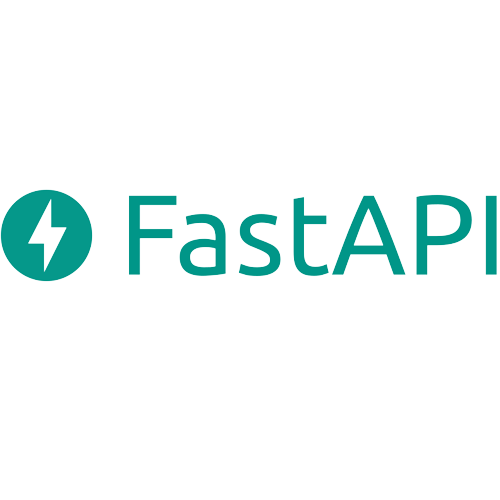
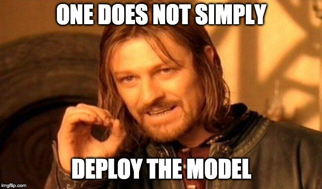

# Model deployment

[Slides](../slides/Deployment.pdf){ .md-button }

- {align=right : style="height:100px;width:100px"}

    Learn how to use requests works and how to create custom APIs

    [:octicons-arrow-right-24: M22: Requests and APIs](apis.md)

- {align=right : style="height:100px;width:100px"}

    Learn how to deploy custom APIs using serverless functions and serverless containers in the cloud

    [:octicons-arrow-right-24: M23: Cloud Deployment](cloud_deployment.md)

- {align=right : style="height:100px;width:100px"}

    Learn how to test APIs for functionality and load

    [:octicons-arrow-right-24: M24: API testing](testing_apis.md)

- {align=right : style="height:100px;width:100px"}

    Learn about different ways to improve the deployment of machine learning models

    [:octicons-arrow-right-24: M25: ML Deployment](ml_deployment.md)

- {align=right : style="height:100px;width:100px"}

    Learn how to create a frontend for your application using Streamlit

    [:octicons-arrow-right-24: M26: Frontend](frontend.md)

Let's say that you have spent 1000 GPU hours and trained the most awesome model that you want to share with the
world. One way to do this is, of course, to just place all your code in a Github repository, upload a file with
the trained model weights to your favorite online storage (assuming it is too big for GitHub to handle) and
ask people to just download your code and the weights to run the code by themselves. This is a fine approach in a small
research setting, but in production, you need to be able to **deploy** the model to an environment that is fully
contained such that people can just execute without looking (too hard) at the code.

<figure markdown>
  { width="600" }
  <figcaption> <a href="https://soliditydeveloper.com/deployments"> Image credit </a> </figcaption>
</figure>

In this session we try to look at methods specialized towards deployment of models on your local machine and
also how to deploy services in the cloud.

!!! tip "Learning objectives"

    The learning objectives of this session are:

    * Understand the basics of requests and APIs
    * Can create custom APIs using the framework `fastapi` and run it locally
    * Knowledge about serverless deployments and how to deploy custom APIs using both serverless functions and
        serverless containers
    * Can create basic continues deployment pipelines for your models
    * Understand the basics of frontend development and how to create a frontend for your application using Streamlit
    * Know how to use more advance frameworks like onnx and bentoml to deploy your machine learning models
