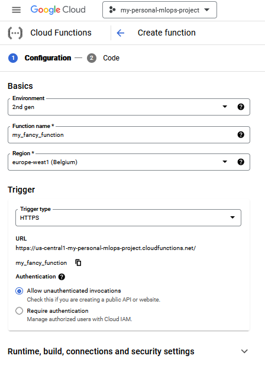
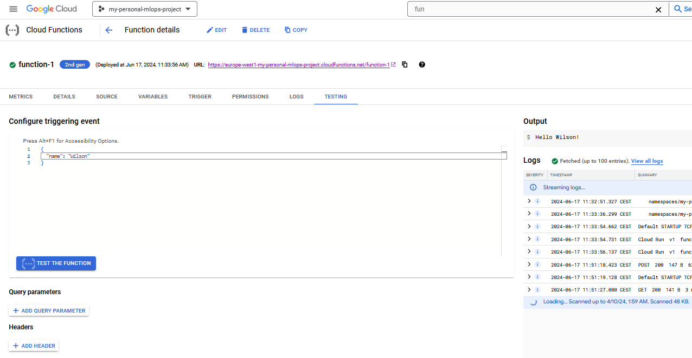

{ align=right width="130"}
{ align=right width="130"}

# Cloud deployment

---

!!! info "Core Module"

We are now returning to using the cloud. In [this module](../s6_the_cloud/using_the_cloud.md) you should have
gone through the steps of having your code in your github repository to automatically build into a docker
container, store that, store data and pull it all together to make a training run. After the training is
completed you should hopefully have a file stored in the cloud with your trained model weights.

Todays exercises will be about serving those model weights to an end user. We focus on two different ways
of deploying our model, `Google cloud functions` and `Google Vertex AI endpoints`.

## Cloud Functions

Cloud functions are the easiest way to get started with deployment because they are what is called *serverless*.
For serverless deployment we still need a server to do the actual workload, however the core concept is that **you**
do you have to manage the server. Everything is magically taken care of behind the scene.

### Exercises

1. Go to the start page of `Cloud Functions`. Can be found in the sidebar on the homepage or you can just
   search for it. Activate the service if not already active.

2. Click the `Create Function` button which should take you to a screen like the image below. Give it a name,
    set the server region to somewhere close by and change the authentication policy to
    `Allow unauthenticated invocations` so we can access it directly from a browser. Remember to note down the
    *URL* of the service somewhere.
    <figure markdown>
    { width="500" }
    </figure>

3. On the next page, for `Runtime` pick the `Python 3.9` option. This will make the inline editor show both
    a `main.py` and `requirements.py` file. Look over them. Click the `Deploy` button in the lower left corner.

4. Afterwards you should see a green check mark beside your function meaning that it is deployed. Click the
    `Test function` button which will take you to the testing page.
    <figure markdown>
    { width="800" }
    </figure>

5. If you know what the application does, it should come as no surprise that it can run without any input. We
    therefore just send an empty request by clicking the `Test The Function` button. Does the function return
    the output you expected? Wait for the logs to show up. What do they show?

    1. What should the `Triggering event` look like in the testing prompt for the program to respond with

        ```txt
        Good day to you sir!
        ```

        Try it out.

    2. Click on the metrics tab. Identify what each panel is showing.

    3. Go to the trigger tab and go to the url for the application.

    4. Checkout the logs tab. You should see that your application have already been invoked multiple times. Also try
        to execute this command in a terminal:

        ```bash
        gcloud functions logs read
        ```

6. Next, we are going to create an application that actually takes some input so we can try to send it requests.
    We provide a very simple
    [sklearn_cloud_function.py script](https://github.com/SkafteNicki/dtu_mlops/tree/main/s7_deployment/exercise_files/sklearn_cloud_functions.py)
    to get started.

    1. Figure out what the script does and run the script. This should create a file with trained model.

    2. Next create a storage bucket and upload the model file to the bucket. You can either do this through the
        webpage or run the following commands:

        ```bash
        gsutil mb gs://<bucket-name>  # mb stands for make bucket
        gsutil cp <file-name> gs://<bucket-name>  # cp stands for copy
        ```

        check that the file is in the bucket.

    3. Create a new cloud function with the same initial settings as the first one. Choose also the `Python 3.9`
        but this time change code to something that can actually use the model we just uploaded. Here is a code
        snippet to help you:

        ```python
        from google.cloud import storage
        import pickle

        BUCKET_NAME = ...
        MODEL_FILE = ...

        client = storage.Client()
        bucket = client.get_bucket(BUCKET_NAME)
        blob = bucket.get_blob(MODEL_FILE)
        my_model = pickle.loads(blob.download_as_string())

        def knn_classifier(request):
            """ will to stuff to your request """
            request_json = request.get_json()
            if request_json and 'input_data' in request_json:
                data = request_json['input_data']
                input_data = list(map(int, data.split(',')))
                prediction = my_model.predict([input_data])
                return f'Belongs to class: {prediction}'
            else:
                return 'No input data received'
        ```

        Some notes:
        * For locally testing the above code you will need to install the `google-cloud-storage` python package
        * Remember to change the `Entry point`
        * Remember to also fill out the `requirements.txt` file. You need at least two packages to run the application
            with `google-cloud-storage` being one of them.
        * If you deployment fails, try to go to the `Logs Explorer` page in `gcp` which can help you identify why.

    4. When you have successfully deployed the model, try to make predictions with it.

7. You can finally try to redo the exercises deploying a Pytorch application. You will essentially
    need to go through the same steps as the sklearn example, including uploading a trained model
    to a storage, write a cloud function that loads it and return some output. You are free to choose
    whatever Pytorch model you want.

## Cloud Run

Cloud functions are great for simple deployments, that can be encapsulated in a single script with only simple
requirements. However, they do not really scale with more advance applications that may depend on multiple programming
languages. We are already familiar with how we can deal with this through containers and Cloud Run is the corresponding
service in GCP for deploying containers.

### Exercises

1. We are going to start locally by developing a small app that we can deploy. We provide two small examples to choose
    from: first a small FastAPI app consisting of this
    [.py file](https://github.com/SkafteNicki/dtu_mlops/tree/main/s7_deployment/exercise_files/simple_fastapi_app.py)
    and this
    [dockerfile](https://github.com/SkafteNicki/dtu_mlops/tree/main/s7_deployment/exercise_files/simple_fastapi_app.dockerfile)
    . Secondly a small [streamlit](https://streamlit.io/) application consisting of just this
    [dockerfile](https://github.com/SkafteNicki/dtu_mlops/tree/main/s7_deployment/exercise_files/streamlit_app.dockerfile)
    . You are free to choose which application to work with.

    1. Start by going over the files belonging to your choice app and understand what it does.

    2. Next build the docker image belonging to the app

        ```bash
        docker build -f <dockerfile> . -t gcp_test_app:latest
        ```

    3. Next tag and push the image to your container registry

        ```bash
        docker tag gcp_test_app gcr.io/<project-id>/gcp_test_app
        docker push gcr.io/<project-id>/gcp_test_app
        ```

        afterwards check you container registry to check that you have successfully pushed the image.

1. Next go to `Cloud Run` in the cloud consol an enable the service

2. Click the `Create Service` button which should bring you to a page similar to the one below

    <p align="center">
        
    </p>

    Do the following:
    * Click the select button, which will bring up all build containers and pick the one you want to deploy. In the
        future you probably want to choose the *Continuously deploy new revision from a source repository* such that a new
        version is always deployed when a new container is build.
    * Hereafter, give the service a name and select the region. We recommend do choose a region close to you, however
        it does not really matter that much for our use case
    * Set the authentication method to *Allow unauthenticated invocations* such that we can call it without
        providing credentials. In the future you may only set that authenticated invocations are allowed.
    * Expand the *Container, Connections, Security* tab and edit the port such that it matches the port exposed in your
        chosen application.

    Finally, click the create button and wait for the service to be deployed (may take some time).

3. If you manage to deploy the service you should see a image like this:

    <p align="center">
        
    </p>

    You can now access you application by clicking url. This will access the root of your application, so you may need
    to add `/` or `/<path>` to the url depending on how the app works.

4. (Optional) Everything we just did to deploy an container can be reproduced using the following command:

    ```bash
    gcloud run deploy $APP --image $TAG --platform managed --region $REGION --allow-unauthenticated
    ```

    and checked using these two commands

    ```bash
    gcloud run services list
    gcloud run services describe $APP --region $REGION
    ```

    feel free to experiment doing the deployment from the command line.

5. As an final exercise, we recommend redoing the above deployment steps with your own developed MNIST code such that
    you get more experience with deploying a machine learning application.

That ends the exercises on deployment. The exercises above is just a small taste of what deployment has to offer. In
both sections we have explicitly chosen to work with *serverless* deployments. But what if you wanted to do the
opposite e.g. being the one in charge of the management of the cluster that handles the deployed services? If you are
really interested in taking deployment to the next level should get started on *kubernetes* which is the de-facto
open-source container orchestration platform that is being used in production environments. If you want to deep dive we
recommend starting [here](https://cloud.google.com/ai-platform/pipelines/docs) which describes how to make pipelines
that are a necessary component before you start to [create](https://cloud.google.com/ai-platform/pipelines/docs/configure-gke-cluster)
your own kubernetes cluster.
