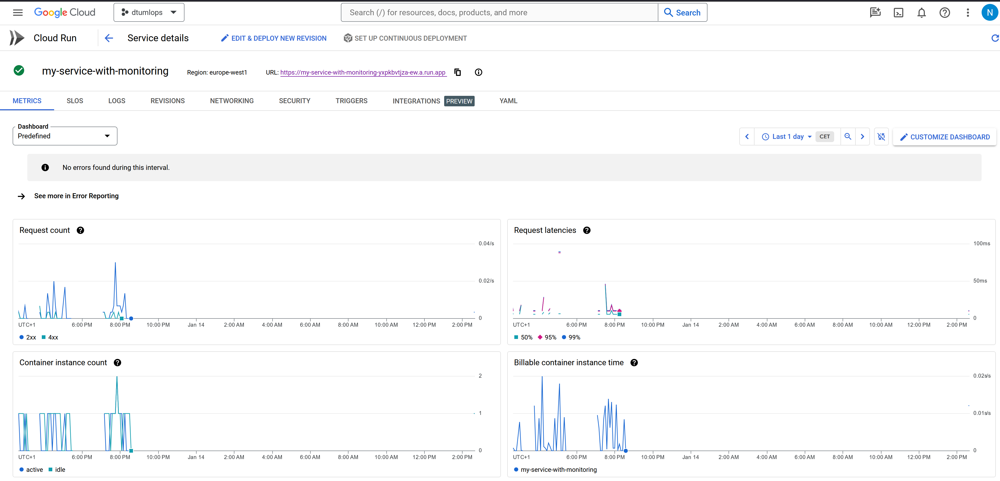
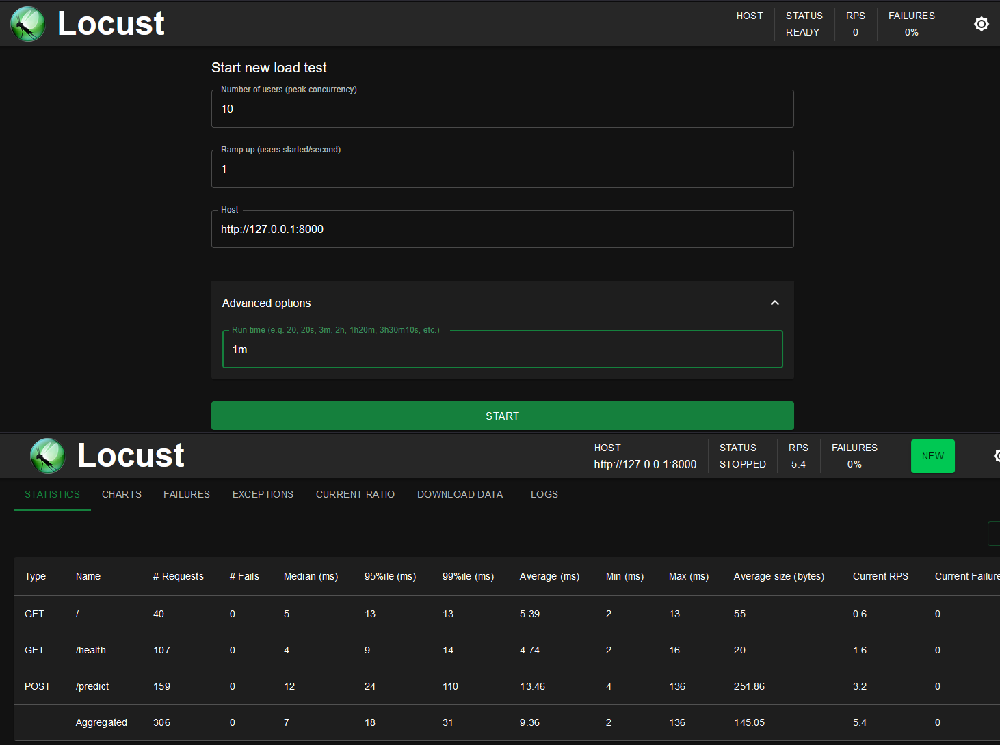

{ align=right width="130"}

# API testing

!!! info "Core Module"

API testing, similar to unit testing, is a type of software testing that involves testing the application programming
interface (API) directly to ensure it meets requirements for functionality, reliability, performance, and security.
The core difference from the unit testing we have been implementing until now is that instead of testing the individual
functions, we are testing the entire API as a whole. API testing is therefore a form of
[integration testing](https://en.wikipedia.org/wiki/Integration_testing). Additionally, another difference is that we
need to simulate API calls that should be as similar as possible to the ones that will be made by the users of the API.

The is in general two things that we want to test when we are working with APIs:

* Does the API work as intended? e.g. for a given input, does it return the expected output?
* Can the API handle the expected load? e.g. if we send 1000 requests per second, does it crash?

In this module, we go over how to do each of them.

## Testing for functionality

Similar to when we wrote unit tests for our code back in [this module](../s5_continuous_integration/unittesting.md) we
can also write tests for our API that checks that our code does what it is supposed to do e.g. by using
`#!python assert` statements. As always we recommend implementing the tests in a separate folder called `tests`, but
we recommend that you add further subfolders to separate the different types of tests. For example, for the type
of machine learning projects and APIs we have been working with in this course:

```plaintext
my_project
|-- src/
|   |-- train.py
|   |-- data.py
|   |-- app.py
|-- tests/
|   |-- unittests/
|   |   |-- test_train.py
|   |   |-- test_data.py
|   |-- integrationtests/
|   |   |-- test_apis.py
```

### ❔ Exercises

In these exercises, we are going to assume that we want to test an API written in FastAPI (see this
[module](../s7_deployment/apis.md)). If the API is written in a different framework then how to write the tests may have
to change.

1. Start by installing [httpx](https://www.python-httpx.org/) which is the client we are going to use during testing:

    ```bash
    pip install httpx
    ```

    Remember to add it to your `requirements.txt` file.

2. If you have already done the module on [unittesting](../s5_continuous_integration/unittesting.md) then you should
    already have a `tests/` folder. If not then create one. Inside the `tests/` folder create a new folder called
    `integrationtests/`. Inside the `integrationtests/` folder create a file called `test_apis.py` and write the
    following code:

    ```python
    from fastapi.testclient import TestClient
    from app.main import app
    client = TestClient(app)
    ```

    this code will create a client that can be used to send requests to the API. The `app` variable is the FastAPI
    application that we want to test.

3. Now, you can write tests that check that the API works as intended, much like you would write unit tests. For
    example, if you have an root endpoint that just returns a simple welcome message you could write a test like this:

    ```python
    def test_read_root(model):
        response = client.get("/")
        assert response.status_code == 200
        assert response.json() == {"message": "Welcome to the MNIST model inference API!"}
    ```

    make sure to always `#!python assert` that the status code is what you expect and that the response is what you
    expect. Add such tests for all the endpoints in your API.

    ??? note "Application with lifespans"

        If you have an application with lifespan events e.g. you have implemented the `lifespan` function in your
        FastAPI application, you need to instead use the `TestClient` in a `with` statement. This is because the
        `TestClient` will close the connection to the application after the test is done. Here is an example:

        ```python
        def test_read_root(model):
            with TestClient(app) as client:
                response = client.get("/")
                assert response.status_code == 200
                assert response.json() == {"message": "Welcome to the MNIST model inference API!"}
        ```

4. To run the tests, you can use the following command:

    ```bash
    pytest tests/integrationtests/test_apis.py
    ```

    Make sure that all your tests pass.

## Load testing

The next type of testing we are going to implement for our application is load testing, which is a kind of
[performance testing](https://en.wikipedia.org/wiki/Software_performance_testing). The goal of load testing is to
determine how an application behaves under both normal and peak conditions. The purpose is to identify the maximum
operating capacity of an application as well as any bottlenecks and to determine which element is causing degradation.

Before we get started on the exercises we recommend that you start by defining an environment variable that contains
the endpoint of your API e.g we need the API running to be able to test it. To begin with, you can just run the API
locally, thus in a terminal window run the following command:

```bash
uvicorn app.main:app --reload
```

by default the API will be running on `http://localhost:8000` which we can then define as an environment variable:

=== "Windows"

    ```bash
    set MYENDPOINT=http://localhost:8000
    ```

=== "Mac/Linux"

    ```bash
    export MYENDPOINT=http://localhost:8000
    ```

However, the end goal is to test an API you have deployed in the cloud. If you have used Google Cloud Run to deploy
your API then you can get the endpoint by going to the UI and looking at the service details:

<figure markdown>
{ width="600" }
<figcaption> The endpoint can be seen in the top center. It always starts with `https://<my-service-name>` followed by
a random string and then `.a.run.app` </a> </figcaption>
</figure>

However, we can also use the `gcloud` command to get the endpoint:

=== "Windows"

    ```bash
    for /f "delims=" %i in ^
    ('gcloud run services describe <name> --region=<region> --format="value(status.url)"') do set MYENDPOINT=%i
    ```

=== "Mac/Linux"

    ```bash
    export MYENDPOINT=$(gcloud run services describe <name> --region=<region> --format="value(status.url)")
    ```

where you need to define `<name>` and `<region>` with the name of your service and the region it is deployed in.

### ❔ Exercises

For the exercises, we are going to use the [locust](https://locust.io/) framework for load testing (the name is a
reference to a locust being a swarm of bugs invading your application). It is a Python framework that allows you to
write tests that simulate many users interacting with your application. It is very easy to get started with and it is
very easy to integrate with your CI/CD pipeline.

1. Install `locust`

    ```bash
    pip install locust
    ```

    Remember to add it to your `requirements.txt` file.

2. Make sure you have written an API that you can test. Else you can for simplicity just use this simple example

    !!! example "Simple hallo world Fastapi example"

        ```python linenums="1" title="model.py"
        --8<-- "s7_deployment/exercise_files/simple_fastapi_app.py"
        ```

3. Add a new folder to your `tests/` folder called `performancetests` and inside it create a file called
    `locustfile.py`. To that file, you need to add the appropriate code to simulate the users that you want to test.
    You can read more about how to write a `locustfile.py`
    [here](https://docs.locust.io/en/stable/writing-a-locustfile.html).

    ??? success "Solution"

        Here we provide a solution to the above simple example:

        ```python linenums="1" title="locustfile.py"
        --8<-- "s7_deployment/exercise_files/locustfile_simple_fastapi_app.py"
        ```

4. Then try to run the `locust` command:

    ```bash
    locust -f tests/performancetests/locustfile.py
    ```

    and then navigate to <http://localhost:8089> in your web browser. You should see a page that looks similar to the
    top of this figure.

    <figure markdown>
    { width="600" }
    </figure>

    you can here define the number of users you want to simulate and how many users you want to spawn per second.
    Finally, you can define which endpoint you want to test. When you are ready you can press the `Start`.

    Afterward, you should see the results of the test in the web browser. Answer the following questions:

    * What is the average response time of your API?
    * What is the 99th percentile response time of your API?
    * How many requests per second can your API handle?

5. Maybe of more use to us is running locust in the terminal. To do this you can run the following command:

    === "Windows"

        ```bash
        locust -f tests/performancetests/locustfile.py \
            --headless --users 10 --spawn-rate 1 --run-time 1m --host %MYENDPOINT%
        ```

    === "Mac/Linux"

        ```bash
        locust -f tests/performancetests/locustfile.py \
            --headless --users 10 --spawn-rate 1 --run-time 1m --host $MYENDPOINT
        ```

    this will run the test with 10 users that are spawned at a rate of 1 per second for 1 minute.

6. (Optional) A good use case for load testing in our case is to test that our API can handle a load right after it
    has been deployed. To do this we need to add appropriate steps to our CI/CD pipeline. Try adding locust to an
    existing or new workflow file in your `.github/workflows/` folder, such that it runs after the deployment step.

    ??? success "Solution"

        The solution here expects that a service called `production-model` has been deployed to Google Cloud Run. Then
        the following steps can be added to a workflow file, to first authenticate with Google Cloud, extract the
        relevant URL, and then run the load test:

        ```yaml

        - name: Auth with GCP
          uses: google-github-actions/auth@v2
          with:
            credentials_json: ${{ secrets.GCP_SA_KEY }}

        - name: Set up Cloud SDK
          uses: google-github-actions/setup-gcloud@v2

        - name: Extract deployed model URL
          run: |
            DEPLOYED_MODEL_URL=$(gcloud run services describe production-model \
              --region=europe-west1 \
              --format='value(status.url)')
            echo "DEPLOYED_MODEL_URL=$DEPLOYED_MODEL_URL" >> $GITHUB_ENV

        - name: Run load test on deployed model
          env:
            DEPLOYED_MODEL_URL: ${{ env.DEPLOYED_MODEL_URL }}
          run: |
            locust -f tests/performance/locustfile.py \
              --headless -u 100 -r 10 --run-time 10m --host=$DEPLOYED_MODEL_URL --csv=/locust/results

        - name: Upload locust results
          uses: actions/upload-artifact@v2
          with:
            name: locust-results
            path: /locust
        ```

        the results can afterward be downloaded from the artifacts tab in the GitHub UI.

## 🧠 Knowledge check

1. In the `locust` framework, what does the `@task` decorator do and what does `@task(3)` mean?

    ??? success "Solution"

        The `@task` decorator is used to define a task that a user can perform. The `@task(3)` decorator is used to
        define a task that a user can perform that is three times more likely to be performed than the other tasks.

2. In the `locust` framework, what does the `wait_time` attribute do?

    ??? success "Solution"

        The `wait_time` attribute is used to define how long a user should wait between tasks. It can be either be a
        fixed number or a random number between two values.

        ```python
        from locust import HttpUser, task, between, constant

        class MyUser(HttpUser):
            wait_time = between(5, 9)
            # or
            wait_time = constant(5)
        ```

3. Load testing can give numbers on average response time, 99th percentile response time, and requests per second. What
    do these numbers tell us about the user experience of the API?

    ??? success "Solution"

        The average response time and 99th percentile response time are both measures how "snappy" the API feels to the
        user. While the average response time is normally considered the most important, the 99th percentile response
        time is also important as it tells us if there are a small amount of users that are experiencing a very slow
        response time. The requests per second tells us how many users the API can handle at the same time. If this
        number is too low it can lead to users experiencing slow response times and may indicate that something is wrong
        with the API.
